= TAK Server:: Configuration Guide
:doctype: article
:showtitle:
:title-separator: ::
:revnumber: 5.1
:revdate: April 2024
:version-label!:
:fragdir: ./fragments
:config_dir: ./configs
:sectnums:
:sectnumlevels: 5
:toc: macro

Distribution Statement A: Approved for public release; distribution is unlimited.

[%always]
<<<

toc::[]

[[about-tak-server-1]]
== About TAK Server

TAK Server is a situational awareness server,
that provides a dynamic Common Operating Picture to users of the Team Awareness Kit,
including ATAK (Android), WinTAK (Windows) and WebTAK.
TAK enables sharing of geolocated information in real time for military forces,
law enforcement, and emergency responders.
It supports both wireless and wired networks, as well as cloud and data center deployment.

[[change-log-1]]
== Change Log

See https://wiki.tak.gov/display/DEV/TAK+Server+Change+Log

[[system-requirements-1]]
== System Requirements

Supported Operating Systems:

* Rocky Linux 8 (Replacement for CentOS 8, which is EOL)
* Red Hat Enterprise Linux (RHEL) 8 or 7
* Ubuntu 22
* Raspberry Pi OS (64-bit)
* CentOS 7 (**_not _**CentOS 8 Stream)

Java 17 is required.
Java 17 is installed by default via package dependencies,
but if your system has a different Java version installed in addition to Java 17,
ensure that TAK Server is using Java 17.

[[server-requirements-3]]
=== Server Requirements

* 4 processor cores
* 8 GB RAM
* 40 GB disk storage

For Raspberry Pi installations, a Pi 4, Model B, Quad-Core 64-bit 8GB RAM version
is recommended for a minimal TAK Server setup
(TAK Server messaging and api services with local PostgreSQL database)

NOTE: Insecure ports are a potential security risk and may allow attackers to gain access
to the system resulting in the disclosure of personal and sensitive information.
Use of unencrypted ports should be avoided to ensure a secure TAK Server deployment.

[[aws-govcloud-recommended-instance-type-3]]
=== AWS / GovCloud Recommended Instance Type

* c5.xlarge
** 4 vCPU
** 8 GB RAM
** Up to 10 Gbps network bandwidth
* For 2-server installation, use this instance type for both servers.

TAK Server is a TLS-enabled networking server.
In order to ensure consistent performance, burstable AWS EC2 instance types such as T2 are not recommended.
TLS and TCP processing requires consistent, continuous CPU performance.
C4 and C5 instances are designed for predictable CPU performance, and are better-suited for TAK Server deployments.

More information about instance types may be found here:

https://aws.amazon.com/ec2/instance-types

Usage of larger instance types or physical servers is supported for scalability,
to support more concurrent active users.

[[installation-1]]
== Installation

[[overview-and-installer-files-3]]
=== Overview and Installer Files

TAK Server supports multiple deployment configurations:

*Single server install*:: One server running TAK Server core (messaging, API, plugins and database):
recommended for fewer than 500 users.

*Two server install*:: One server running TAK Server core (messaging, API, plugins and database)
and a second server running PostgreSQL database: recommended for more than 500 users.

*Containerized docker install*:: One container running TAK Server core (messaging, API, plugins and database)
and another container running PostgreSQL database (designed for operating systems other than CentOS 7 / RHEL 7).
Hardened containers are published to both tak.gov and IronBank
(see https://ironbank.dso.mil/repomap?searchText=tak%20server).

The following installation files are provided:

*Installer for single-server install*

RHEL/Rocky/CentOS::: takserver-5.1-RELEASE-x.noarch.rpm

Ubuntu/RaspPi::: takserver_5.1-RELEASE-x_all.deb

*Database installer for two-server install*

RHEL/Rocky/CentOS:: takserver-database-5.1-RELEASE-x.noarch.rpm

Ubuntu/RaspPi:: takserver-database_5.1-RELEASE-x_all.deb

*Core installer for two-server install*

RHEL/Rocky/CentOS:: takserver-core-5.1-RELEASE-x.noarch.rpm
Ubuntu/RaspPi:: takserver-core_5.1-RELEASE-x_all.deb

*Containerized docker install bundle*

takserver-docker-5.1-RELEASE-x.zip

Containerized hardened docker install bundle

takserver-docker-hardened-5.1-RELEASE-x.zip

*TAK Server Federation Hub Installer*

RHEL/Rocky/CentOS:: takserver-fed-hub-5.1-RELEASE-x.noarch.rpm
Ubuntu/RaspPi:: takserver-fed-hub_5.1-RELEASE-x_all.deb

Federation hub documentation available here:

.Verifying GPG signatures on RPM packages
The GPG public key for TAK Server can be found under
https://artifacts.tak.gov/ui/repos/tree/General/TAKServer/release/ .
Select the TAK Server release version and download the file _takserver-public-gpg.key_

Import the key to the RPM key management:
[source,shell]
----
sudo rpm --import takserver-public-gpg.key
----
Verifying signature for the rpm installer package:
[source,shell]
----
rpm --checksig takserver-5.1-RELEASE<version>.noarch.rpm
----
Example of a successful output:
[source,text]
----
takserver-5.1-RELEASE28.noarch.rpm: rsa sha1 (md5) pgp md5 OK`
----
Example of a failed output:
[source,text]
----
takserver-5.1-RELEASE28.noarch.rpm: RSA sha1 ((MD5) PGP) md5 NOT OK (MISSING KEYS: (MD5) PGP#6851f5b5)
----
If the RPM packages were not signed with a GPG key, the output might look like:
[source,text]
----
takserver-5.1-RELEASE25.noarch.rpm: sha1 md5 OK
----

.Verifying GPG signatures for DEB packages

Select the appropriate TAK Server release version and download
the file _takserver-public-gpg.key_ and _deb_policy.pol_.

Install the debsig-verify utility
[source,shell]
----
sudo apt install debsig-verify
----

Using the ID within the deb_policy.pol file, ex. _039FCDA2D8907527_,
run the following command to verify signed TAK Server deb resources:
[source,shell]
----
sudo mkdir /usr/share/debsig/keyrings/039FCDA2D8907527
sudo mkdir /etc/debsig/policies/039FCDA2D8907527
sudo touch /usr/share/debsig/keyrings/039FCDA2D8907527/debsig.gpg
sudo gpg --no-default-keyring --keyring /usr/share/debsig/keyrings/039FCDA2D8907527/debsig.gpg --import takserver-public-gpg.key
sudo cp deb_policy.pol /etc/debsig/policies/039FCDA2D8907527/debsig.pol
debsig-verify -v takserver-5.1-RELEASE_all.deb
----

Confirm signature verification by identifying statement:
[source,text]
----
debsig: Verified package from 'TAK Product Center' (TAK Server Release)
----

[[new-installation-one-server-3]]
=== New Installation: One Server

Start with a fresh install of a supported OS.
For AWS / cloud installation, see recommended instance type on <<aws-govcloud-recommended-instance-type-3>>.
An OS install with a GUI is recommended, so that a web browser can be run locally to configure TAK Server.

Increase system limit for number of concurrent TCP connections (do once):

[source,shell]
----
echo -e "* soft nofile 32768\n* hard nofile 32768" | sudo tee --append /etc/security/limits.conf > /dev/null
----

[[tak-server-installation-7]]
==== TAK Server Installation

[[rocky-linux-8-15]]
===== Rocky Linux 8

* Install EPEL (EPEL provides certain dependencies required by PostgreSQL.)
* Install postgres yum repository.
* Install java 17.
* Disable the postgresql module
(so the later postgresql and postgis specific versions aren't inaccessible due to 'modular filtering').
* Enable PowerTools (needed for dependencies of postgis.) Install TAK server.
* Apply SELinux takserver-policy.

include::{fragdir}/note-install-postgres.adoc[]

[source,shell]
----
sudo dnf install epel-release -y
sudo dnf install -y https://download.postgresql.org/pub/repos/yum/reporpms/EL-8-x86_64/pgdg-redhat-repo-latest.noarch.rpm
sudo dnf -qy module disable postgresql && sudo dnf update -y
sudo dnf install java-17-openjdk-devel -y
sudo dnf config-manager --set-enabled powertools
sudo dnf install takserver-5.1-RELEASEx.noarch.rpm -y
sudo dnf install checkpolicy
cd /opt/tak && sudo ./apply-selinux.sh && sudo semodule -l | grep takserver
----

include::{fragdir}/check-java-version-rh.adoc[]

[[rhel-8-15]]
===== RHEL 8

====== RHEL8 FIPS mode Support.

* TAK Server has experimental support for RHEL8 FIPS mode.
* This is intended for evaluation only, for hardened environments.
* These steps enable TAK Server to operate with RHEL FIPS mode enabled, but does not provide full FIPS 140 compliance.

See below for a new option for certs script when using FIPS mode.
Client certificates generated with FIPS mode may not work with ATAK.

[source,shell]
----
sudo rpm --import http://download.fedoraproject.org/pub/epel/RPM-GPG-KEY-EPEL-8
sudo rpm --import https://download.postgresql.org/pub/repos/yum/RPM-GPG-KEY-PGDG
----

.by default allow any
[source,shell]
----
sudo vi /etc/fapolicyd/rules.d/99-whitelist.rules
----
Add line:
[source,text]
----
deny perm=any all : all
----

[source,shell]
----
sudo vi /etc/fapolicyd/rules.d/39-tak.rules
----
Add lines:
[source,text]
----
allow perm=open all : dir=/opt/tak/ ftype=application/x-sharedlib trust=0
allow perm=open exe=/usr/pgsql-15/bin/postgres : all
----

Custom certificates with stronger algorithms will need to be generated for use on systems with FIPS enabled.
To do this: follow the existing certificate instructions,
but append `--fips` to the end of each `./makeRootCa.sh` and `./makeCert.sh` command.

Note::: ATAK may not support certificates generated with these stronger algorithms

====== Install EPEL (EPEL provides certain dependencies required by PostgreSQL.)
* Install postgres yum repository.
* Install java 17.
* Disable the postgresql module
(so the later postgresql and postgis specific versions aren't inaccessible due to 'modular filtering').
* Enable Repository Management and repository CodeReady Builder.
* Install TAK server.
* Apply SELinux takserver-policy.

include::{fragdir}/note-install-postgres.adoc[]

[source,shell]
----
sudo dnf install https://dl.fedoraproject.org/pub/epel/epel-release-latest-8.noarch.rpm -y
sudo dnf install -y https://download.postgresql.org/pub/repos/yum/reporpms/EL-8-x86_64/pgdg-redhat-repo-latest.noarch.rpm
sudo dnf update -y && sudo dnf install java-17-openjdk-devel -y _
sudo dnf module disable postgresql
sudo subscription-manager config --rhsm.manage_repos=1
sudo subscription-manager repos --enable codeready-builder-for-rhel-8-x86_64-rpms_
----

include::{fragdir}/note-system-no-repositories.adoc[]

[source,shell]
----
sudo dnf install takserver-5.1-RELEASEx.noarch.rpm -y
sudo dnf install checkpolicy
cd /opt/tak && sudo ./apply-selinux.sh && sudo semodule -l | grep takserver
----

include::{fragdir}/check-java-version-rh.adoc[]

[[rhel-7-15]]
===== RHEL 7

Install EPEL (EPEL provides certain dependencies required by PostgreSQL.)
Install postgres yum repository (required in order to install up-to-date Postgresql and PostGIS packages.)
Install OpenJDK 17 and other dependencies.
Install TAK server

include::{fragdir}/note-install-postgres.adoc[]

[source,shell]
----
sudo yum install https://dl.fedoraproject.org/pub/epel/epel-release-latest-7.noarch.rpm -y
sudo yum install https://download.postgresql.org/pub/repos/yum/reporpms/EL-7-x86_64/pgdg-redhat-repo-latest.noarch.rpm -y
sudo yum install -y postgis33_15 postgis33_15-utils
sudo yum install -y postgresql15-server postgresql15-contrib
sudo yum install -y https://download.oracle.com/java/17/latest/jdk-17_linux-x64_bin.rpm
sudo rpm -ivh takserver-5.1-RELEASEx.noarch.rpm --nodeps
----

include::{fragdir}/note-yum-no-jdk17.adoc[]

include::{fragdir}/check-java-version-rh.adoc[]

[[ubuntu-and-raspberry-pi-os-15]]
===== Ubuntu and Raspberry Pi OS

Install the postgres repository
(required in order to install up-to-date Postgresql and PostGIS packages.)

Install TAK server

[source,shell]
----
sudo mkdir -p /etc/apt/keyrings
sudo curl https://www.postgresql.org/media/keys/ACCC4CF8.asc --output /etc/apt/keyrings/postgresql.asc
echo "deb [signed-by=/etc/apt/keyrings/postgresql.asc] http://apt.postgresql.org/pub/repos/apt/ $(lsb_release -cs)-pgdg main" \
 sudo tee /etc/apt/sources.list.d/postgresql.list
sudo apt update
sudo apt install ./takserver-5.1-RELEASEx_all.deb
----

include::{fragdir}/check-java-version-rh.adoc[]

[[centos-7-15]]
===== CentOS 7

Install EPEL (EPEL provides certain dependencies required by PostgreSQL.)
Install postgres yum repository (required in order to install up-to-date Postgresql and PostGIS packages.)
Install OpenJDK 17 and other dependencies.
Install Tak server.

include::{fragdir}/note-install-postgres.adoc[]

[source,shell]
----
sudo yum install epel-release -y
sudo yum install https://download.postgresql.org/pub/repos/yum/reporpms/EL-7-x86_64/pgdg-redhat-repo-latest.noarch.rpm -y
sudo yum install -y postgis33_15 postgis33_15-utils
sudo yum install -y postgresql15-server postgresql15-contrib
sudo yum install -y https://download.oracle.com/java/17/latest/jdk-17_linux-x64_bin.rpm
sudo rpm -ivh takserver-5.1-RELEASEx.noarch.rpm --nodeps
----

include::{fragdir}/note-yum-no-jdk17.adoc[]

include::{fragdir}/check-java-version-rh.adoc[]

[[yum-install-from-tak.gov-15]]
===== yum Install From tak.gov

Check to see if a .repo file exists for tak.gov

[source,shell]
----
ls /etc/yum.repos.d/Takserver.repo
----

If it exists, skip down to the yum install of takserver database.
If it doesn't exist, create a new .repo file to point yum to the yum repo on tak.gov.

[source,shell]
----
cd /etc/yum.repos.d
sudo vi Takserver.repo
----

You can also edit using another editor besides vi.
Update the file Takserver.repo to contain:

[source,text]
----
[takrepo]
name=TakserverRepository
baseurl=https://<ARTIFACTORY_USER>:<ARTIFACTORY_TOKEN>@artifacts.tak.gov/artifactory/takserver-yum
enabled=1
gpgcheck=0
----

Where <ARTIFACTORY_USER> is a valid login to Artifactory that has access to
the *takserver-yum* repo and <ARTIFACTORY_TOKEN> is a special token unique to
the given Artifactory user that can be retrieved by that user using
the "Set Me Up" menu option to retrieve it.

Note::: Do NOT use your password as it the Token is more secure and cannot be used for logging in.
Only for retrieving or publishing.
Also: When you change the password of the given user,
you will also need to retrieve the new token which is based on it
and update the *baseurl* in the Takserver.repo file.

Save the Takserver.repo file and then do the install of the takserver.

[source,shell]
----
sudo yum install takserver-core-5.1-RELEASEx
----

[[configure-tak-server-installation-7]]
==== Configure TAK Server installation

[source,shell]
----
sudo systemctl daemon-reload
----

On resource limited hosts,
such as a *_Raspberry Pi_*,
you may start/stop only essential api and messaging TAK Server services with:

[source,shell]
----
sudo systemctl [start|stop] takserver-noplugins
----
Otherwise, to start/stop all TAK Server service:

[source,shell]
----
sudo systemctl [start|stop] takserver
----

You can set TAK Server to start at boot by running
[source,shell]
----
sudo systemctl enable takserver
----
or with resource limited hosts:
[source,shell]
----
sudo systemctl enable takserver-noplugins
----

For secure operation, TAK Server requires a keystore and truststore (X.509 certificates).

*Next, follow the instructions in Appendix B to create these certificates.
TAK Server by default is TLS only, so certificate generation,
including an administrative certificate is required for configuration.
In addition, if you would like to configure TLS for Postgres database connection,
follow additional steps in Appendix D.*

Verify that the steps in Appendix B have been followed by checking the following items:

Certificates are present at:
*`opt/tak/certs/files`*

The TAK Server was restarted,
the admin cert has been generated, and
an **admin** account in TAK Server was created with the command:

[source,shell]
----
sudo java -jar /opt/tak/utils/UserManager.jar certmod -A /opt/tak/certs/files/admin.pem
----

While following the instructions in Appendix B, you will have created an **admin** certificate.
Import this certificate into your browser, so that you can access the Admin.
It will be located here on your TAK Server machine:
[source,text]
----
/opt/tak/certs/files/admin.pem
----

Import this client certificate into your browser.

If you are using Firefox, go to 
#Settings -> Preferences -> Privacy & Security -> Certificates -> View Certificates#

Go to Import.
Upload this file:

[source,text]
----
/opt/tak/certs/files/admin.p12
----

Enter the certificate password.
The default password is _atakatak_

Browse to:
link:https://localhost:8443/[https://localhost:8443]

Select the **admin** certificate to log in.

An error message similar to this indicates that the correct client certificate
has not been imported into the browser:

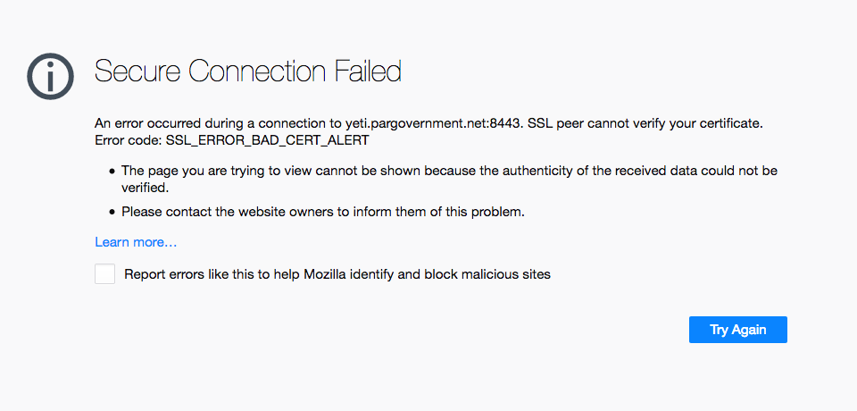

[[new-installation-two-servers-3]]
=== New Installation: Two Servers

Follow the procedures in the following two sections to install the database server, and the messaging server.
For AWS / cloud installation, see recommended instance type in <<aws-govcloud-recommended-instance-type-3>>.
Use this instance type for both servers.

[[server-one-database-server-7]]
==== Server One: Database Server

[[dependency-setup-15]]
===== Dependency Setup

First, update firewall rules to allow communication with server two, for TCP port 5432.

[[rocky-linux-8-47]]
====== Rocky Linux 8

Setup the extra postgres yum repo for the latest postgres and postgis.
Disable the postgresql stream to install the specific postgres version we depend on.
Enable the 'powertools' repo for postgis dependencies.
Install TAK Server RPM database and its dependencies.

include::{fragdir}/note-install-postgres.adoc[]

[source,shell]
----
sudo dnf install epel-release -y
sudo dnf install https://download.postgresql.org/pub/repos/yum/reporpms/EL-8-x86_64/pgdg-redhat-repo-latest.noarch.rpm -y
sudo dnf update -y
sudo dnf module disable postgresql
sudo dnf install java-17-openjdk-devel -y
sudo dnf config-manager --set-enabled powertools
----

Make sure the database RPM is in the current directory

[source,shell]
----
sudo dnf install takserver-database-5.1-RELEASE-x.noarch.rpm --setopt=clean_requirements_on_remove=false -y
----

include::{fragdir}/check-java-version-rh.adoc[]

[[rhel-8-47]]
====== RHEL 8

Setup the extra postgres yum repo for the latest postgres and postgis.
Disable the postgresql stream to install the specific postgres version we depend on.
Install TAK Server RPM database and its dependencies.

include::{fragdir}/note-install-postgres.adoc[]

[source,shell]
----
sudo dnf install https://dl.fedoraproject.org/pub/epel/epel-release-latest-8.noarch.rpm -y
sudo dnf install https://download.postgresql.org/pub/repos/yum/reporpms/EL-8-x86_64/pgdg-redhat-repo-latest.noarch.rpm -y
sudo dnf update -y && sudo dnf install java-17-openjdk-devel -y
sudo dnf module disable postgresql
sudo subscription-manager config --rhsm.manage_repos=1
sudo subscription-manager repos --enable codeready-builder-for-rhel-8-x86_64-rpms_
----

include::{fragdir}/note-system-no-repositories.adoc[]

Make sure the database RPM is in the current directory

[source,shell]
----
sudo dnf install takserver-database-5.1-RELEASE-x.noarch.rpm --setopt=clean_requirements_on_remove=false -y
----

include::{fragdir}/check-java-version-rh.adoc[]

[[rhel-7-47]]
====== RHEL 7

Setup the extra postgres yum repo for the latest postgres and postgis.
Install OpenJDK 17 and other dependencies.
Install TAK Server RPM database.

include::{fragdir}/note-install-postgres.adoc[]

[source,shell]
----
sudo yum install https://dl.fedoraproject.org/pub/epel/epel-release-latest-7.noarch.rpm -y
sudo yum install https://download.postgresql.org/pub/repos/yum/reporpms/EL-7-x86_64/pgdg-redhat-repo-latest.noarch.rpm -y
sudo yum update -y
sudo yum install -y postgis33_15 postgis33_15-utils
sudo yum install -y postgresql15-server postgresql15-contrib
sudo yum install -y https://download.oracle.com/java/17/latest/jdk-17_linux-x64_bin.rpm
----

include::{fragdir}/note-yum-no-jdk17.adoc[]

Make sure the database RPM is in the current directory

[source,shell]
----
sudo rpm -ivh takserver-database-5.1-RELEASEx.noarch.rpm --nodeps
----

include::{fragdir}/check-java-version-rh.adoc[]

[[ubuntu-raspberry-pi-os-31]]
====== Ubuntu & Raspberry Pi OS

Install the postgres repository (required in order to install up-to-date Postgresql and PostGIS packages.)
Install TAK Server database.
**Use database DEB.
**Configure TAK Server Database installation

include::{fragdir}/note-install-postgres.adoc[]

[source,shell]
----
sudo mkdir -p /etc/apt/keyrings
sudo curl https://www.postgresql.org/media/keys/ACCC4CF8.asc --output /etc/apt/keyrings/postgresql.asc
echo "deb [signed-by=/etc/apt/keyrings/postgresql.asc] http://apt.postgresql.org/pub/repos/apt/ $(lsb_release -cs)-pgdg main" \
  sudo tee /etc/apt/sources.list.d/postgresql.list
sudo apt update
sudo apt install _takserver-database-5.1-RELEASEx_all.deb
----

Open the file `/opt/tak/CoreConfig.example.xml` and look for the auto-generated password for the database.
This password will be used to configure the Core Server.

[source,text]
----
<connection url="jdbc:postgresql://127.0.0.1:5432/cot" username="martiuser" password="*Database_password*" />_
----

include::{fragdir}/check-java-version-rh.adoc[]

[[centos-7-47]]
====== CentOS 7

Setup the extra postgres yum repo for the latest postgres and postgis.
Install OpenJDK 17 and other dependencies.
Install TAK Server RPM database.

include::{fragdir}/note-install-postgres.adoc[]

[source,shell]
----
sudo yum install epel-release -y
sudo yum install https://download.postgresql.org/pub/repos/yum/reporpms/EL-8-x86_64/pgdg-redhat-repo-latest.noarch.rpm -y
sudo yum update -y
sudo yum install -y postgis33_15 postgis33_15-utils
sudo yum install -y postgresql15-server postgresql15-contrib
sudo yum install -y https://download.oracle.com/java/17/latest/jdk-17_linux-x64_bin.rpm
----

include::{fragdir}/note-yum-no-jdk17.adoc[]

Make sure the database RPM is in the current directory

[source,shell]
----
sudo yum install takserver-database-5.1-RELEASE-x.noarch.rpm --setopt=clean_requirements_on_remove=false -y
----

include::{fragdir}/check-java-version-rh.adoc[]

[[server-two-core-server-7]]
==== Server Two: Core Server

Start with a fresh install of a supported OS.
An install with a GUI is recommended, so that a web browser can be run locally to configure TAK Server.

Increase system limit for number of concurrent TCP connections (do once)

[source,shell]
----
echo -e "* soft nofile 32768\n* hard nofile 32768" | sudo tee --append /etc/security/limits.conf > /dev/null
----

[[install-tak-server-15]]
===== Install TAK Server

[[rocky-linux-8-79]]
====== Rocky Linux 8

[source,shell]
----
sudo dnf install java-17-openjdk-devel -y
sudo dnf install takserver-core-5.1-RELEASEx.noarch.rpm -y
sudo dnf install checkpolicy
cd /opt/tak && sudo ./apply-selinux.sh && sudo semodule -l | grep takserver
----

include::{fragdir}/check-java-version-rh.adoc[]

[[rhel-8-79]]
====== RHEL 8

[source,shell]
----
sudo dnf update -y && sudo dnf install java-17-openjdk-devel -y
sudo dnf install takserver-core-5.1-RELEASEx.noarch.rpm -y
sudo dnf install checkpolicy
cd /opt/tak && sudo ./apply-selinux.sh && sudo semodule -l | grep takserver
----

include::{fragdir}/check-java-version-rh.adoc[]

[[rhel-7-79]]
====== RHEL 7

Install EPEL (EPEL provides certain dependencies required by PostgreSQL.)
Install postgres yum repository (required in order to install up-to-date Postgresql and PostGIS packages.)
Install OpenJDK 17 and other dependencies.
Install Tak server.

include::{fragdir}/note-install-postgres.adoc[]

[source,shell]
----
sudo yum install https://dl.fedoraproject.org/pub/epel/epel-release-latest-7.noarch.rpm -y
sudo yum install https://download.postgresql.org/pub/repos/yum/reporpms/EL-7-x86_64/pgdg-redhat-repo-latest.noarch.rpm -y
sudo yum install -y postgis33_15 postgis33_15-utils
sudo yum install -y postgresql15-server postgresql15-contrib
sudo yum install -y https://download.oracle.com/java/17/latest/jdk-17_linux-x64_bin.rpm
sudo rpm -ivh takserver-core-5.1-RELEASEx.noarch.rpm --nodeps
----

include::{fragdir}/note-yum-no-jdk17.adoc[]

include::{fragdir}/check-java-version-rh.adoc[]

[[ubuntu-raspberry-pi-os-63]]
====== Ubuntu & Raspberry Pi OS

[source,shell]
----
sudo apt install takserver-core-5.1-RELEASEx_all.deb
----

include::{fragdir}/check-java-version-deb.adoc[]

[[centos-7-79]]
====== CentOS 7

Install EPEL (EPEL provides certain dependencies required by PostgreSQL.)
Install postgres yum repository (required in order to install up-to-date Postgresql and PostGIS packages.)
Install OpenJDK 17 and other dependencies.
Install Tak server.

include::{fragdir}/note-install-postgres.adoc[]

[source,shell]
----
sudo yum install epel-release -y
sudo yum install https://download.postgresql.org/pub/repos/yum/reporpms/EL-7-x86_64/pgdg-redhat-repo-latest.noarch.rpm -y
sudo yum install -y postgis33_15 postgis33_15-utils
sudo yum install -y https://download.oracle.com/java/17/latest/jdk-17_linux-x64_bin.rpm
sudo rpm -ivh takserver-core-5.1-RELEASEx.noarch.rpm --nodeps
----

include::{fragdir}/note-yum-no-jdk17.adoc[]

include::{fragdir}/check-java-version-rh.adoc[]

[[yum-install-from-tak.gov-47]]
====== yum Install From tak.gov

Check to see if a .repo file exists for tak.gov

[source,shell]
----
ls /etc/yum.repos.d/Takserver.repo_
----

If it exists, skip down to the yum install of takserver database.
If it doesn't exist, create a new .repo file to point yum to the yum repo on tak.gov.

[source,shell]
----
cd /etc/yum.repos.d
sudo vi Takserver.repo
----
You can also edit using another editor besides vi.
Update the file Takserver.repo to contain:

[source,text]
----
[takrepo]
name=TakserverRepository
baseurl=https://<ARTIFACTORY_USER>:<ARTIFACTORY_TOKEN>@artifacts.tak.gov/artifactory/takserver-yum
enabled=1
gpgcheck=0
----
Where <ARTIFACTORY_USER> is a valid login to Artifactory that has access to the *takserver-yum* repo
and <ARTIFACTORY_TOKEN> is a special token unique to the given Artifactory user
that can be retrieved by that user using the "Set Me Up" menu option to retrieve it.

Note::: Do NOT use your password as it the Token is more secure and cannot be used for logging in.
Only for retrieving or publishing.
Note::: When you change the password of the given user,
you will also need to retrieve the new token which is based on it and update the *baseurl* in the Takserver.repo file.

Save the Takserver.repo file and then do the install of the takserver.

[source,shell]
----
sudo yum install takserver-core-5.1-RELEASEx
----

[[configuration-15]]
===== Configuration

Configure database connection by updating `/opt/tak/CoreConfig.xml`:
[source,xml]
----
<repository enable="true" numDbConnections="200"
            primaryKeyBatchSize="500" insertionBatchSize="500">
   <connection url="jdbc:postgresql://*Database_server_IP_address*:5432/cot"
               username="martiuser" password="*Database_password*"/>
</repository>
----

*Database_server_IP_address*:: supply an appropriate host identifier.
*Database_password*:: supply the PostgreSQL password.

[source,bash]
----
sudo systemctl daemon-reload
----

Start/stop TAK Server services with:

[source,shell]
----
sudo systemctl [start|stop] takserver
----
Or on resource limited hosts:
[source,shell]
----
sudo systemctl [start|stop] takserver-noplugins
----
You can set TAK Server to start at boot by running
[source,shell]
----
sudo systemctl enable takserver
----
For secure operation, TAK Server requires a keystore and truststore (X.509 certificates).

Next, follow the instructions in Appendix B to create these certificates.
TAK Server by default is TLS only, so certificate generation,
including an administrative certificate is required for configuration.

Verfiy that the steps in Appendix B have been followed by checking the following items:

Certificates are present at:
*_opt/tak/certs/files_*

The admin cert has been generated and an admin account in TAK Server was created with the command:
[source,shell]
----
sudo java -jar /opt/tak/utils/UserManager.jar certmod -A /opt/tak/certs/files/*admin*.pem_
----

Import this client certificate into your browser.

If you are using Firefox, go to
#Settings -> Preferences -> Privacy & Security -> Certificates -> View Certificates#.

Go to Import.
Upload this file:
`/opt/tak/certs/files/admin.p12`

Enter the certificate password.
The default password is _atakatak_

Browse to:
link:https://localhost:8443/[https://localhost:8443]

Select the admin certificate to log in.

An error message similar to this indicates that the correct client certificate has not been imported into the browser:

Once logged in with the admin certificate, configure the TAK Server with the following instructions:

*Configure TAK Server to connect to the database.
Access the Database configuration settings:*

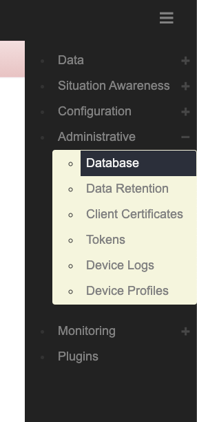

Edit the database connection address, specifying the hostname or IP address of the database server:

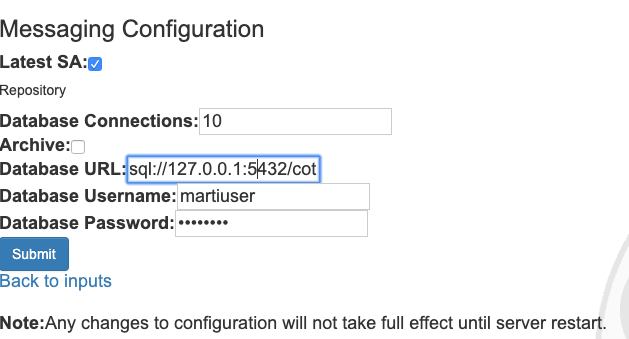

.Restart TAK Server
[source,shell]
----
sudo systemctl restart takserver
----

.Or on resource limited hosts
[source,shell]
----
sudo systemctl restart takserver-noplugins
----
.If you would like to configure TLS for Postgres database connection, refer to Appendix D.

[[use-setup-wizard-to-configure-tak-server-3]]
=== Use Setup Wizard to Configure TAK Server

The TAK Server configuration wizard will help you set up common configuration options
once you have installed and started TAK Server.
The wizard will guide you through the setup process for a secure configuration,
using the default ports that ATAK and WinTAK will connect to.

Once you have created your administrative login credentials as in the previous section, go to:

link:https://localhost:8443/Marti/wizard/[https://localhost:8443/setup/]
(Recommended, Uses the more secure client certificate)

Then follow the prompts to begin configuring.
The wizard will first walk you through recommended security configuration:

NOTE::: Insecure ports are a potential security risk
and may allow attackers to gain access to the system
resulting in the disclosure of personal and sensitive information.
Use of unencrypted ports should be avoided to ensure a secure TAK Server deployment.

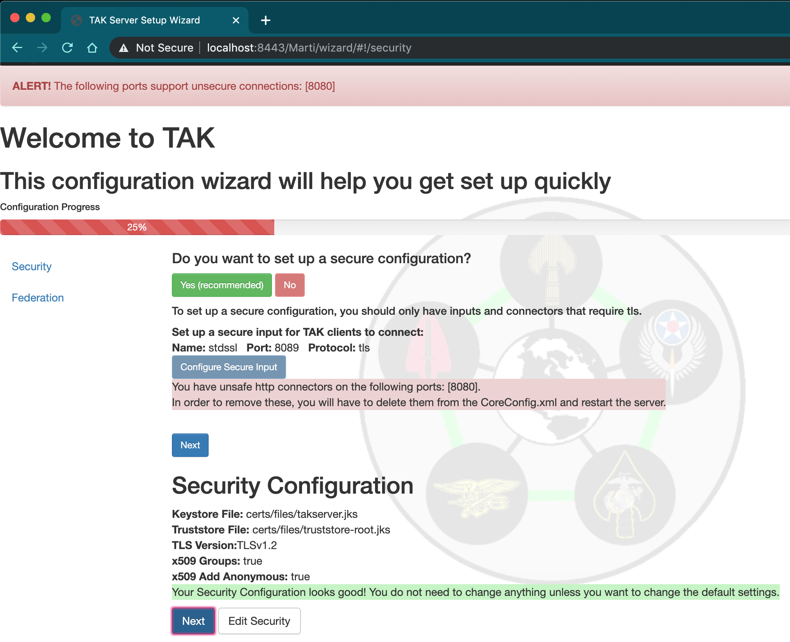

Followed by the recommended federation configuration, if you wish to set up your TAK Server to support federation.
(For more information on federation, go to section 8):

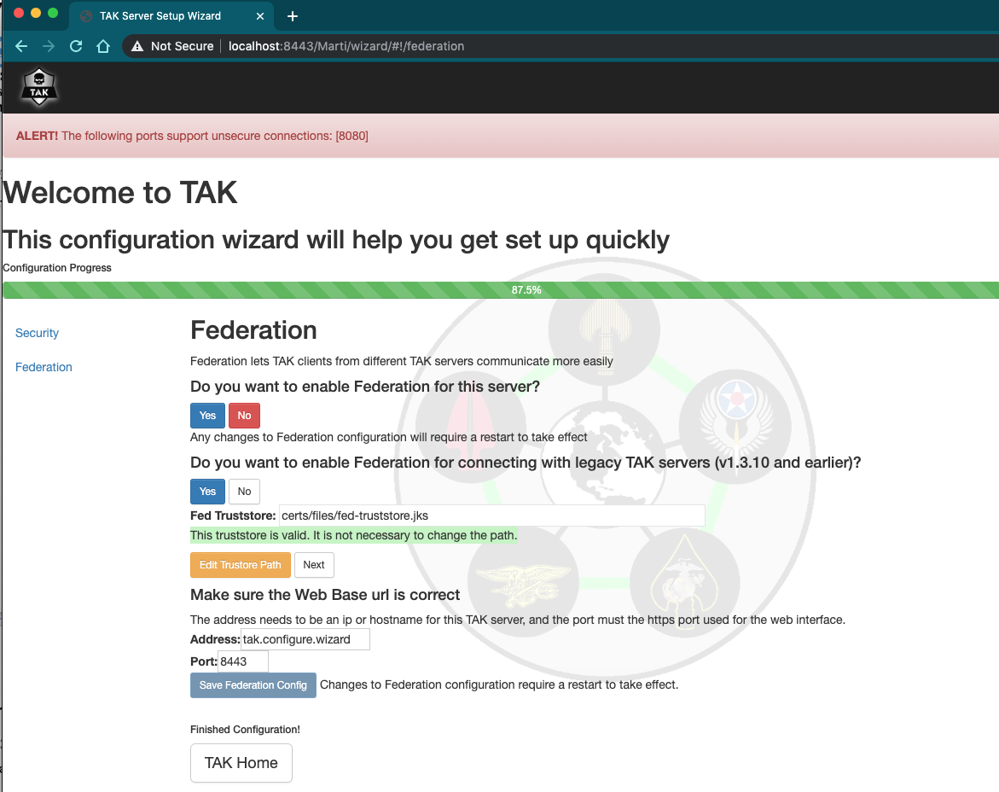

[[upgrade-existing-tak-server-installation-3]]
=== Upgrade existing TAK Server installation

Follow this procedure to upgrade a system running** **TAK Server.

[[single-server-upgrade-7]]
==== Single-Server Upgrade

[[rocky-linux-8-95]]
===== Rocky Linux 8

Install EPEL (EPEL provides certain dependencies required by PostgreSQL.)
Install postgres yum repository.
Install java 17.
Disable the postgresql module (so the later postgresql and
postgis specific versions aren't inaccessible due to 'modular filtering').
Enable PowerTools (needed for dependencies of postgis.) Install TAK server.

[source,shell]
----
sudo dnf install epel-release -y
sudo dnf install -y https://download.postgresql.org/pub/repos/yum/reporpms/EL-8-x86_64/pgdg-redhat-repo-latest.noarch.rpm
sudo dnf -qy module disable postgresql && sudo dnf update -y
sudo dnf install java-17-openjdk-devel -y
sudo dnf config-manager --set-enabled powertools
----

_Upgrade Tak server_
[source,shell]
----
sudo dnf install takserver-5.1-RELEASEx.noarch.rpm --setopt=clean_requirements_on_remove=false -y
----

include::{fragdir}/check-java-version-rh.adoc[]

[[rhel-8-95]]
===== RHEL 8 

_Setup the extra postgres yum repo for the latest postgres and postgis.
Install Java 17.
Disable the postgresql stream to install the specific postgres version we depend on.
Install TAK Server RPM database and its dependencies._

[source,shell]
----
sudo dnf install https://dl.fedoraproject.org/pub/epel/epel-release-latest-8.noarch.rpm -y 
sudo dnf install https://download.postgresql.org/pub/repos/yum/reporpms/EL-8-x86_64/pgdg-redhat-repo-latest.noarch.rpm -y
sudo dnf update -y && sudo dnf install java-17-openjdk-devel -y
sudo dnf module disable postgresql
sudo subscription-manager config --rhsm.manage_repos=1
sudo subscription-manager repos --enable codeready-builder-for-rhel-8-x86_64-rpms_
----

include::{fragdir}/note-system-no-repositories.adoc[]

_Upgrade Tak server_

[source,shell]
----
sudo dnf install takserver-5.1-RELEASEx.noarch.rpm --setopt=clean_requirements_on_remove=false -y
----

include::{fragdir}/check-java-version-rh.adoc[]

[[rhel-7-95]]
===== RHEL 7

If you have not previously done so,
install EPEL (EPEL provides certain dependencies required by PostgreSQL.)
Install postgres yum repository (required in order to install up-to-date Postgresql and PostGIS packages.)
Install OpenJDK 17 and other dependencies.
Upgrade TAK server

[source,shell]
----
sudo yum install https://dl.fedoraproject.org/pub/epel/epel-release-latest-7.noarch.rpm  -y 
sudo yum install https://download.postgresql.org/pub/repos/yum/reporpms/EL-7-x86_64/pgdg-redhat-repo-latest.noarch.rpm -y
sudo yum install -y postgis33_15 postgis33_15-utils
sudo yum install -y postgresql15-server postgresql15-contrib
sudo yum install -y https://download.oracle.com/java/17/latest/jdk-17_linux-x64_bin.rpm
sudo rpm -Uvh takserver-5.1-RELEASEx.noarch.rpm --nodeps
----

include::{fragdir}/note-yum-no-jdk17.adoc[]

include::{fragdir}/check-java-version-rh.adoc[]

[[ubuntu-and-raspberry-pi-os-31]]
===== Ubuntu and Raspberry Pi OS

_Upgrade Tak server_
[source,shell]
----
sudo apt install ./takserver-5.1-RELEASEx_all.deb
----

include::{fragdir}/check-java-version-deb.adoc[]

[[centos-7-95]]
===== Centos 7

If you have not previously done so,
install EPEL (EPEL provides certain dependencies required by PostgreSQL.)
Install postgres yum repository (required in order to install up-to-date Postgresql and PostGIS packages.)
Install OpenJDK 17 and other dependencies.
Upgrade Tak server.
[source,shell]
----
sudo yum install epel-release -y
sudo yum install https://download.postgresql.org/pub/repos/yum/reporpms/EL-7-x86_64/pgdg-redhat-repo-latest.noarch.rpm -y
sudo yum install -y postgis33_15 postgis33_15-utils
sudo yum install -y postgresql15-server postgresql15-contrib
sudo yum install -y https://download.oracle.com/java/17/latest/jdk-17_linux-x64_bin.rpm
sudo rpm -Uvh takserver-5.1-RELEASEx.noarch.rpm --nodeps_
----

include::{fragdir}/note-yum-no-jdk17.adoc[]

include::{fragdir}/check-java-version-rh.adoc[]

[[two-server-upgrade-7]]
==== Two-Server Upgrade

[[rocky-linux-8-111]]
===== Rocky Linux 8

Upgrade the two TAK Server packages on the servers on which they are installed.

*First*, on the core server, install Java 17 and upgrade the core package:

[source,shell]
----
sudo dnf install java-17-openjdk-devel -y
sudo dnf install takserver-core-5.1-RELEASEx.noarch.rpm -y
----

_*Next*, on the database server, upgrade the database._
_Setup the extra postgres yum repo for the latest postgres and postgis.
Disable the postgresql stream to install the specific postgres version we depend on.
Install Java 17.
Enable the 'powertools' repo for postgis dependencies.
Install TAK Server RPM database and its dependencies._

[source,shell]
----
sudo dnf install epel-release -y
sudo dnf install https://download.postgresql.org/pub/repos/yum/reporpms/EL-8-x86_64/pgdg-redhat-repo-latest.noarch.rpm -y
sudo dnf update -y
sudo dnf module disable postgresql
sudo dnf install java-17-openjdk-devel -y
sudo dnf config-manager --set-enabled powertools
----

Make sure the database RPM is in the current directory.

[source,shell]
----
sudo dnf install takserver-database-5.1-RELEASE-x.noarch.rpm --setopt=clean_requirements_on_remove=false -y
----

include::{fragdir}/update-postgresql-v15.adoc[]

In *both* servers.
include::{fragdir}/check-java-version-rh.adoc[]

[[rhel-8-111]]
===== RHEL 8

Upgrade the two TAK Server packages on the servers on which they are installed.

*First*, on the core server, install Java 17 and upgrade the core package:
[source,shell]
----
sudo dnf update -y && sudo dnf install java-17-openjdk-devel -y
sudo dnf install takserver-core-5.1-RELEASEx.noarch.rpm -y
----

_*Next*, on the database server, upgrade the database._
_Setup the extra postgres yum repo for the latest postgres and postgis.
Install Java 17.
Disable the postgresql stream to install the specific postgres version we depend on.
Install TAK Server RPM database and its dependencies._

[source,shell]
----
sudo dnf install https://dl.fedoraproject.org/pub/epel/epel-release-latest-8.noarch.rpm -y
sudo dnf install https://download.postgresql.org/pub/repos/yum/reporpms/EL-8-x86_64/pgdg-redhat-repo-latest.noarch.rpm -y
sudo dnf update -y && sudo dnf install java-17-openjdk-devel -y
sudo dnf module disable postgresql
sudo subscription-manager config --rhsm.manage_repos=1
sudo subscription-manager repos --enable codeready-builder-for-rhel-8-x86_64-rpms_
----

include::{fragdir}/note-system-no-repositories.adoc[]

Make sure the database RPM is in the current directory

[source,shell]
----
sudo dnf install takserver-database-5.1-RELEASE-x.noarch.rpm --setopt=clean_requirements_on_remove=false -y
----

include::{fragdir}/update-postgresql-v15.adoc[]

_In *both* servers_
include::{fragdir}/check-java-version-rh.adoc[]

[[rhel-7-111]]
===== RHEL 7 

_Install OpenJDK 17 and other dependencies (if you have not previously done so.) _

[source,shell]
----
sudo yum install -y postgis33_15 postgis33_15-utils
sudo yum install -y postgresql15-server postgresql15-contrib
sudo yum install -y https://download.oracle.com/java/17/latest/jdk-17_linux-x64_bin.rpm
----

include::{fragdir}/note-yum-no-jdk17.adoc[]

Upgrade the two TAK Server packages on the servers on which they are installed.

_*First*_, upgrade the core package:

[source,shell]
----
sudo rpm -Uvh takserver-core-5.1-RELEASEx.noarch.rpm --nodeps_
----

*Next*, upgrade the database.
Setup the extra postgres yum repo for the latest postgres and postgis.
Install TAK Server RPM database and its dependencies.

[source,shell]
----
sudo yum install https://dl.fedoraproject.org/pub/epel/epel-release-latest-7.noarch.rpm
sudo yum install https://download.postgresql.org/pub/repos/yum/reporpms/EL-7-x86_64/pgdg-redhat-repo-latest.noarch.rpm -y
sudo yum update -y
----

Make sure the database RPM is in the current directory

[source,shell]
----
sudo rpm -Uvh takserver-database-5.1-RELEASEx.noarch.rpm --nodeps
----
include::{fragdir}/update-postgresql-v15.adoc[]

_In both servers_
include::{fragdir}/check-java-version-rh.adoc[]

[[ubuntu-and-raspberry-pi-os-47]]
===== Ubuntu and Raspberry Pi OS

Upgrade the two TAK Server packages on the servers on which they are installed.

_*First*_, upgrade the core package.
[source,shell]
----
sudo apt install ./takserver-core_5.1-RELEASE-x_all.deb
----
*Next*, upgrade the database.

[source,shell]
----
sudo apt install ./takserver-database_5.1-RELEASE-x_all.deb
----
include::{fragdir}/update-postgresql-v15.adoc[]

_In both servers_
include::{fragdir}/check-java-version-rh.adoc[]

[[centos-7-111]]
===== _*_Centos 7_*_

Install OpenJDK 17 and other dependencies (if you have not previously done so.)

[source,shell]
----
sudo yum install -y postgis33_15 postgis33_15-utils
sudo yum install -y postgresql15-server postgresql15-contrib
sudo yum install -y https://download.oracle.com/java/17/latest/jdk-17_linux-x64_bin.rpm
----
include::{fragdir}/note-yum-no-jdk17.adoc[]

Upgrade the two TAK Server packages on the servers on which they are installed.
_*First*_, upgrade the core package:
[source,shell]
----
sudo rpm -Uvh takserver-core-5.1-RELEASEx.noarch.rpm --nodeps
----
*Next*, upgrade the database.
Setup the extra postgres yum repo for the latest postgres and postgis.
Install TAK Server RPM database and its dependencies.

[source,shell]
----
sudo yum install epel-release -y
sudo yum install https://download.postgresql.org/pub/repos/yum/reporpms/EL-8-x86_64/pgdg-redhat-repo-latest.noarch.rpm -y
sudo yum update -y
----

Make sure the database RPM is in the current directory

[source,shell]
----
sudo yum install takserver-database-5.1-RELEASE-x.noarch.rpm --setopt=clean_requirements_on_remove=false -y
----
include::{fragdir}/update-postgresql-v15.adoc[]

_In *both* servers_
include::{fragdir}/check-java-version-rh.adoc[]

[[containerized-installation-docker-3]]
=== Containerized Installation (Docker)

[[ironbank-7]]
==== IronBank

See https://ironbank.dso.mil/repomap?searchText=tak%20server (Platform One account required).

TAK Server hardened container images are published to the Platform One Iron Bank container repository.
See README for each container for installation instructions.

[[building-and-installing-container-images-using-docker-7]]
==== Building and Installing Container Images using Docker

TAK Server can be installed using docker.
Start by downloading container images from tak.gov.
You will need the docker release which comes as a zip file called 'takserver-docker-<version>.zip'.

If you are using CentOS 7, follow these instructions first to install docker,
start the docker daemon and use it as a regular user:

https://www.digitalocean.com/community/tutorials/how-to-install-and-use-docker-on-centos-7

Next, unzip the docker zip file.
*All further commands should be run from this top level 'takserver-docker-<version>' directory*.
If you are familiar with the rpm install,
the 'tak' folder within the 'takserver-docker-<version>' directory represents
the '/opt/tak' directory installed by the rpm.
When the takserver containers are built,
the 'tak' directory will be mounted to '/opt/tak' within the containers.
Therefore, any references to '/opt/tak' outside this section of the guide
will be equivalent to the 'tak' directory you have on the host,
or '/opt/tak' if you are working from inside the container.

The 'tak' directory is where the coreconfig, certificates, logs and other TAK configuration/tools will live.
This folder is shared between the host, the takserver container and the takserver database container.
This means you can tail the logs or manually edit the coreconfig
from the host without being inside the container.

*Notes for running in Windows Subsystem for Linux (WSL) 2:*

When running TAK Server in the WSL2 environment,
follow the steps outlined in the Best Practices section here
https://docs.docker.com/desktop/windows/wsl/ to maximize TAK Server performance.
Specifically, it’s recommended that you copy the 'takserver-docker-<version>.zip'
file into your WSL user’s home directory and execute all docker commands from there
(vs accessing your Windows filesystem from /mnt).
For example, if your WSL username was ‘tak’ and you’re running Ubuntu-20.04,
copy the docker .zip file to `\\wsl$\Ubuntu-20.04\home\tak` using Windows Explorer.
Next, navigate to that directory within WSL.
From there, unzip the file and run the docker commands below for TAK Server.
It’s important to unzip the file from within WSL to ensure permissions are set up correctly.

===== TAK Server CoreConfig Setup:

1. Open tak/CoreConfig.example.xml and set a database password
2. Make any other configuration changes you need

*TAK Server Database Container Setup:*

1. Build TAK server database image:
+
[source,shell]
----
docker build -t takserver-db:"$(cat tak/version.txt)" -f docker/Dockerfile.takserver-db .
----
2. Create a new docker network for the current tak version:
+
[source,shell]
----
docker network create takserver-"$(cat tak/version.txt)"
----
3. The TAK Server database container can be configured to persist data directly to the host
or only within the container.
   a. To persist to the host, create an empty host directory
      (unless you have a directory from a previous docker install you want to reuse).
      For upgrading purposes, we recommend that you keep the takserver database directory outside
      the 'takserver-docker-<version>' directory structure.
+
[source,shell]
----
docker run -d -v <absolute path to takserver database directory>:/var/lib/postgresql/data:z \
  -v $(pwd)/tak:/opt/tak:z -it -p 5432:5432 --network takserver-"$(cat tak/version.txt)" \
  --network-alias tak-database --name takserver-db-"$(cat tak/version.txt)" \
  takserver-db:"$(cat tak/version.txt)"
----
    b. To run TAK server database with container only persistence
+
[source,shell]
----
docker run -d -v $(pwd)/tak:/opt/tak:z -it -p 5432:5432 --network takserver-"$(cat tak/version.txt)" \
  --network-alias tak-database --name takserver-db-"$(cat tak/version.txt)" takserver-db:"$(cat tak/version.txt)"
----

===== TAK Server Container Setup:

1. Build TAK Server image:
+
[source,shell]
----
docker build -t takserver:"$(cat tak/version.txt)" -f docker/Dockerfile.takserver .
----
2. Running TAK Server container: use `-p <host port>:<container port>` to map any
   additional ports you have configured.
   *Adding new inputs or changing ports while the container is running
   will require the container to be recreated so that the new port mapping can be added*.
+
[source,shell]
----
docker run -d -v $(pwd)/tak:/opt/tak:z -it \
  -p 8089:8089 -p 8443:8443 -p 8444:8444 -p 8446:8446 -p 9000:9000 -p 9001:9001 \
  --network takserver-"$(cat tak/version.txt)" --name takserver-"$(cat tak/version.txt)" \
  takserver:"$(cat tak/version.txt)"
----
3.**Before using the TAK Server, you must set-up the certificates for secure operation.**
  If you have already configured certificates you can skip this step.
  You can also copy existing certificates into 'tak/certs/files'
  and a UserAuthetication.xml file into 'tak/' to reuse existing certificate authentication settings.
  **Any change to certificates while the container is running will require either
  a TAK server restart or container restart.**
  Additional certificate details can be found in Appendix B.
  a. Edit tak/certs/cert-metadata.sh
  b. Generate root ca
+
[source,shell]
----
docker exec -it takserver-"$(cat tak/version.txt)" bash -c "cd /opt/tak/certs && ./makeRootCa.sh"
----
   c. Generate server cert
+
[source,shell]
----
docker exec -it takserver-"$(cat tak/version.txt)" bash -c "cd /opt/tak/certs && ./makeCert.sh server takserver"
----
   d. Create client cert(s)
+
[source,shell]
----
docker exec -it takserver-"$(cat tak/version.txt)" bash -c "cd /opt/tak/certs && ./makeCert.sh client <user>"
----
   e. Restart takserver to load new certificates
+
[source,shell]
----
docker exec -d takserver-"$(cat tak/version.txt)" bash -c "cd /opt/tak/ && ./configureInDocker.sh"
----
   f. Tail takserver logs from the host.
      *Once TAK server has successfully started, proceed to the next step.*
+
[source,shell]
----
tail -f tak/logs/takserver-messaging.log
tail -f tak/logs/takserver-api.log
----
3. Accessing takserver
Create admin client certificate for access on secure port 8443 (https):
+
[source,shell]
----
docker exec takserver-"$(cat tak/version.txt)" \
  bash -c "cd /opt/tak/ && java -jar utils/UserManager.jar certmod -A certs/files/<client cert>.pem"
----

===== Hardened TAK Server Setup:

The hardened TAK Database and Server containers provide additional security
by including the use of secure Iron Bank base images, container health checks,
and minimizing user privileges within the containers.

The hardened TAK images are available in a zip file, takserver-docker-hardened-<version>.zip.
The steps for setting up the hardened containers are similar to
the standard docker installation steps given above except for the following:

====== Certificate Generation:

The certificate generation container is only required to run once for TAK Server initialization.
Run all commands in this section from the root of the unzipped hardened docker contents.

1. Build the Certificate Authority Setup Image:
+
[source,shell]
----
docker build -t ca-setup-hardened --build-arg ARG_CA_NAME=<CA_NAME> --build-arg ARG_STATE=<ST> \
  --build-arg ARG_CITY=<CITY> --build-arg ARG_ORGANIZATIONAL_UNIT=<UNIT> \
  -f docker/Dockerfile.ca .
----
2. Run the Certificate Authority Setup Container:
   If certificates have previously been generated and exist in
   the tak/cert/files path when building the ca-setup-hardened image
   then certificate generation will be skipped at runtime.
+
[source,shell]
----
docker run --name ca-setup-hardened -it -d ca-setup-hardened
----
3. Copy the generated certificates for TAK Server:
+
[source,shell]
----
docker cp ca-setup-hardened:/tak/certs/files files
[ -d tak/certs/files ] || mkdir tak/certs/files \
&& docker cp ca-setup-hardened:/tak/certs/files/takserver.jks tak/certs/files/ \
&& docker cp ca-setup-hardened:/tak/certs/files/truststore-root.jks tak/certs/files/ \
&& docker cp ca-setup-hardened:/tak/certs/files/fed-truststore.jks tak/certs/files/ \
&& docker cp ca-setup-hardened:/tak/certs/files/admin.pem tak/certs/files/ \
&& docker cp ca-setup-hardened:/tak/certs/files/config-takserver.cfg tak/certs/files/
----

====== TAK Server Database Hardened Container Setup:

1. Building the hardened docker images requires creating an Iron Bank/Repo1 account
to access the approved base images.
To create an account, follow the instructions in
the https://repo1.dso.mil/dsop/dccscr#getting-started[IronBank Getting Started] page.
To download the base images via the CLI,
see the instructions in the https://repo1.dso.mil/dsop/dccscr#registry-access[Registry Access] section.
After obtaining the necessary credentials, run:
+
[source,shell]
----
docker login registry1.dso.mil
----
2. Follow the instructions in the **TAK Server CoreConfig Setup** section and
update the <connection-url> tag with the hardened TAK Database container name.
For example:
+
[source,text]
----
connection url="jdbc:postgresql://tak-database-hardened-<version>:5432/cot" username="martiuser" password=<password>/>
----
3. Create a new docker network for the current tak version:
+
[source,shell]
----
docker network create takserver-net-hardened-"$(cat tak/version.txt)"
----
+
Ensure in the db-utils/pg_hba.conf file that there is an entry
for the subnet of the hardened takserver network.
To determine the subnet of the network:
+
[source,shell]
----
docker network inspect takserver-net-hardened-"$(cat tak/version.txt)"
----
+
Or to specify the subnet on network creation:
+
[source,shell]
----
docker network create takserver-net-hardened-"$(cat tak/version.txt)" --subnet=<subnet>
----
4. Build the hardened TAK Database image:
+
[source,shell]
----
docker build -t tak-database-hardened:"$(cat tak/version.txt)" -f docker/Dockerfile.hardened-takserver-db .
----
5. Run the hardened TAK Database container:
+
[source,shell]
----
docker run --name tak-database-hardened-"$(cat tak/version.txt)" \
  --network takserver-net-hardened-"$(cat tak/version.txt)" --network-alias tak-database \
  -d tak-database-hardened:"$(cat tak/version.txt)" -p 5432:5432
----

===== TAK Server Hardened Container Setup

1. Build the hardened TAK Server image:
+
[source,shell]
----
docker build -t takserver-hardened:"$(cat tak/version.txt)" -f docker/Dockerfile.hardened-takserver .
----
2. Run the hardened TAK Server container:
+
[source,shell]
----
docker run --name takserver-hardened-"$(cat tak/version.txt)" \
  --network takserver-net-hardened-"$(cat tak/version.txt)" \
  -p 8089:8089 -p 8443:8443 -p 8444:8444 -p 8446:8446 \
  -t -d takserver-hardened:"$(cat tak/version.txt)"
----

====== Configuring Certificates

1. Get the admin certificate fingerprint
+
[source,shell]
----
docker exec -it ca-setup-hardened \
  bash -c "openssl x509 -noout -fingerprint -md5 -inform pem -in files/admin.pem | grep -oP 'MD5 Fingerprint=\K.*'"
----
2. Add the certificate fingerprint as the admin after the hardened TAK server container has started
(about 60 seconds)
+
[source,shell]
----
docker exec -it takserver-hardened-"$(cat tak/version.txt)" \
  bash -c 'java -jar /opt/tak/utils/UserManager.jar usermod -A -f <admin cert fingerprint> admin'
----

===== Useful Commands

To run these commands on the hardened containers, add the `-hardened` suffix to the container names.

.View images:
[source,shell]
----
docker images takserver
docker images takserver-db
----
.View containers
All: `docker ps -a`
Running: `docker ps`
Stopped: `docker ps -a | grep Exit`

.Exec into container

[source,shell]
----
docker exec -it takserver-"$(cat tak/version.txt)" bash
docker exec -it takserver-db-"$(cat tak/version.txt)" bash
----

.Exec command in container
[source,shell]
----
docker exec -it takserver-"$(cat tak/version.txt)" bash -c "<command>"
docker exec -it takserver-db-"$(cat tak/version.txt)" bash -c "<command>"
----

.Tail takserver logs
[source,shell]
----
tail -f tak/logs/takserver-messaging.log
tail -f tak/logs/takserver-api.log
----

.Restart TAK server

[source,shell]
----
docker exec -d takserver-"$(cat tak/version.txt)" bash -c "cd /opt/tak/ && ./configureInDocker.sh"
----

.Start/Stop container:

[source,shell]
----
docker <start/stop> takserver-"$(cat tak/version.txt)"
docker <start/stop> takserver-db-"$(cat tak/version.txt)"
----

.Remove container:

[source,shell]
----
docker rm -f takserver-"$(cat tak/version.txt)"
docker rm -f takserver-db-"$(cat tak/version.txt)"
----

[[configure-system-firewall-3]]
=== Configure System Firewall

One of the most common problems people have is the system default firewall blocking their traffic.

The full procedure for configuring the firewall is complex and beyond the scope of this guide,
and is an important concern for system configuration.
Consult your network administrator and/or the firewalld documentation
at https://fedoraproject.org/wiki/FirewallD.

The following tips will get you started for lab/field environments.

[[rhel-rocky-linux-and-centos-7]]
==== RHEL, Rocky Linux, and CentOS

To verify whether a firewall is running, use the command:
[source,shell]
----
sudo systemctl status firewalld.service
----

To see what zones are running:
[source,shell]
----
sudo firewall-cmd --get-active-zones
----

If you are working from a fresh OS install, the only active zone is 'public'.

For each zone, you'll want to enable TCP (and possibly UDP) ports
for the inputs in your `CoreConfig.xml` file, plus the web server's port.
For example,
[source,shell]
----
sudo firewall-cmd --zone=public --add-port 8089/tcp –permanent
sudo firewall-cmd --zone=public --add-port 8443/tcp --permanent
----

The ports you'll need to open for the default configuration are 8089 and 8443.
Finally, enable your new firewall rules:
[source,shell]
----
sudo firewall-cmd –reload
----

[[ubuntu-and-rasapberry-pi-7]]
==== Ubuntu and Rasapberry Pi

UFW (Uncomplicated Firewall) is a utility for managing firewalls.
If is not installed on your server.
Install with the following:
[source,shell]
----
sudo apt install ufw
----
IMPORTANT:: *_Raspberry Pi_* installs, please reboot your device after installing ufw.

To check the status of the firewall service with current port rules:
[source,shell]
----
sudo ufw status
----

Perform the following commands to set initial rules for your firewall:
[source,shell]
----
sudo ufw default deny incoming
sudo ufw default allow outgoing
sudo ufw allow ssh
----

Turn on the firewall:
[source,shell]
----
sudo ufw enable
----
Add default configuration TAK Server ports:
[source,shell]
----
sudo ufw allow 8089
sudo ufw allow 8443
----

[[software-installation-location-3]]
=== Software Installation Location

The RPM installer places the TAK server software and configuration in the directory */opt/tak*.
It creates a user named *tak* who is the owner of the files in that directory tree.
*Always use this tak user when editing CoreConfig.xml or generating certificates.
You can become the tak user by entering:*
[source,shell]
----
sudo su tak
----

[[configuration-17]]
== Configuration

Configuration is primarily done through the web interface.
Changes made in the interface will be reflected in the /opt/tak/CoreConfig.xml file.
If that file does not exist
(e.g. on a fresh install)
then when TAK Server starts up it will copy `/opt/tak/CoreConfig.example.xml`.
The example has many commented out options.
Notable configuration options:

* inputs: In the <network> section there are a series of <input> elements.
These define ports the server will listen on.
Protocol options are as follows:
** udp: standard CoT udp protocol; unencrypted
** mcast: like udp, but has additional configuration option for multicast group
** tcp: publish-only port; standard CoT tcp protocol; unencrypted
** stcp: streaming/bi-directional; this is for ATAK to connect to.
Unencrypted, for testing only
** tls: TCP+TLS streaming/bi-directional for encrypted communication with TAK clients
* <auth> : you can use either a flat file or an LDAP backend for group filtering support
* <security>: here you specify the keystore files to use for the secure port(s)

[[configuring-security-through-web-ui-certificatestls-3]]
=== Configuring Security through Web UI (Certificates/TLS)

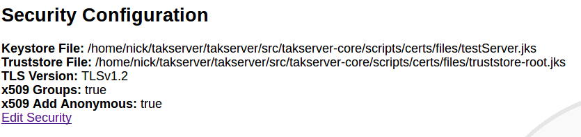

Security and authentication options for TAK Server can be set up using a web interface.
To access this page in the menu bar go to Configuration > Manage Security and Authentication Configuration.
This page will contain both Security and Authentication configuration current values.
To modify the Security Configuration click "Edit Security".
This will allow changes to the server's certificates,
the version of TLS used, x509 Groups settings and x509 Add Anonymous settings.
Note: Changes made here will only take effect after a server restart.

[[group-filtering-3]]
=== Group Filtering 

TAK Server has the ability to segment users so they only see a subset of the other users on the system.
This is achieved by assigning groups to individual connections.
If ATAK-A shares common group membership in at least one group with ATAK-B, they share data with each other.
If not otherwise specified, all connections default to being in the special "__ANON__" group
(note 2 underscores as prefix and postfix).
There are three ways to assign groups to a connection:

* Assigning <filtergroup> elements to <inputs>: this is simple,
but provides no access control if you have multiple ports configured on the same server.
* Active Directory / LDAP / Flat file with additional authentication message
* Active Directory / LDAP / Flat file without additional authentication messages
(uses certificate-based identification)

Details on the three options:

[[group-assignment-by-input-3]]
=== Group Assignment by Input

<inputs> can drive group filtering, even without authentication messages.
Version 1.3.0 added group filtering based on LDAP groups.
This necessitated a new authentication message from ATAK.
This worked for the streaming connections, but wouldn't work for the connection-less UDP traffic.

We added an additional configuration option for inputs to
allow the connection-less traffic to be routed according to the group filtering.
An input definition like this:

[source,xml]
----
<input _name="stdudp" protocol="udp" port="8087">
    <filtergroup>TEST1</filtergroup>
</input>
----

would have the effect of making every CoT event that came into the 'stdudp' input
be associated with the "TEST1" group _instead of_ the anonymous group.
If there is no filtergroup specified, the default is the old behavior, which is a special anonymous group.
The anonymous group has a name "__ANON__" that can be used to explicitly add it back in if needed.
The filtergroup option can be used with the streaming input protocols as well (stcp, tls),
the effect of which is that any subscriptions made by connecting to that port
inherit the filter group from the input.
<filtergroup> cannot be used in conjunction with the "auth" attribute on the same input.
You can however use them on separate inputs, for example:

[source,xml]
----
<input _name="stdudp" protocol="udp" port="8087">
  <filtergroup>CN=TAK1,DC=...</filtergroup>
</input>
<input _name="sec" protocol="tls" port="8089" auth="ldap" />
----

Note that when trying to interact with LDAP groups,
you need to use the fully qualified group name that LDAP/ActiveDirectory reports.

[[input-configuration-ui-7]]
==== Input Configuration UI

Inputs can be dynamically added, modified and deleted in the TAK Server user interface,
under the menu heading *#Configuration → Input Definitions#*.
The UI also shows activity for each input, in terms of number of reads and messages.
For the streaming protocols (stcp, tls),
the activity is the sum for _all_ connections made using that particular input port.

[[group-assignment-using-authentication-messages-3]]
=== Group Assignment Using Authentication Messages

If ATAK or another TAK client is configured to send an authentication message
after establishing a connection to TAK Server,
the username and password credentials contained in that message will be used,
in conjunction with an authentication backend, to determine the group membership of a user.
TAK Server will then filter messages according to common group membership,
in a similar fashion to filtering configured by <filtergroups> for a given <input>.

TAK Server can be configured at the input level to expect authentication messages
with each new client connection.
If the authentication message is not sent, or is invalid, the client will be disconnected.
The "auth" attribute on the input indicates which authentication strategy
will be used when processing authentication messages.
A value of "file" tells TAK Server to validate authentication credentials using the flat-file backend.
A value of "ldap" indicates that an Active Directory or LDAP server
should be used to validate the credentials.

For example, this input definition specifies streaming TCP, encrypted with TLS,
authenticating the user with a client certificate and also requiring an authentication message,
and using the LDAP authentication backend:
[source,xml]
----
<input _name="ldapssl" protocol="tls" port="8091" auth="ldap"/>
----

[[group-assignment-using-client-certificates-3]]
=== Group Assignment Using Client Certificates

TAK Server can be configured to use only the information contained in a client certificate,
when looking up group membership for a user.
In this case, the TAK client is configured to use TLS and a client certificate when connecting to TAK server,
but does not send an authentication message.
This eliminates the requirement to cache credentials on the device,
or enter credentials prior to establishment of each new connection.
TAK Server will then filter messages according to common group membership,
in a similar fashion to input-level filtering with filter groups.
When analyzing the X.509 client certificate presented by the TAK client,
TAK Server will look at the DN attribute in the certificate, extract the CN value from the DN (if present).
The CN is regarded as the username, and is used to look up group membership in authentication backends.
For example, consider this DN in a client certificate:
[source,text]
----
CN=jkirk, O=TAK, C=US
----

The CN value *jkirk* will be used as the username.
The process for deciding which authentication backend to use depends on
whether an Active Directory (AD) LDAP configuration is present in CoreConfig.xml.
Valid service account credentials must be configured in CoreConfig.xml.
If AD authentication is configured, the user account is matched by the *sAMAccountName* LDAP attribute.
At client authentication time, if groups are found in AD for the user, those groups are used by TAK Server.
If no groups are found, the flat-file authentication backend is searched for a match on the username.
If no groups are found for the user in either repository, the user is assigned to the "__ANON__" group.

When configuring the input, a TLS input with an auth type of *x509* directs TAK Server
to use the client certificate for both authentication and group assignment.
On the input configuration, the on or example, this input definition specifies streaming TCP encrypted with TLS,
authenticating the user with a client certificate and also requiring an authentication message,
and using the LDAP authentication backend:

[source,xml]
----
<input _name="ldapssl" protocol="tls" port="8091" auth="x509"/>
----

[[authentication-backends-3]]
=== Authentication Backends

[[file-based-7]]
==== File-Based

There is now a flat-file option available to inputs.
Previously the only valid value for the <input> "auth" attribute was "ldap". "file" is now another valid value.
The example configuration file (CoreConfig.example.xml) contains an example
of how to configure the File-based backend.

A utility for creating and maintaining that flat file is included in the release.
Run...
[source,shell]
----
sudo java -jar /opt/tak/utils/UserManager.jar
----
and look at the various options for the 'offlineFileAuth'.

[[active-directory-ad-ldap-7]]
==== Active Directory (AD) / LDAP

TAK Server can be configured to use an Active Directory or LDAP server to authenticate users, and assign groups.
LDAP configuration for TAK Server varies depending on the configuration of the AD or LDAP server.
Here is an example.
Note that it contains credentials for a service account.
This is required for group membership lookup using a client cert:
[source,xml]
----
<auth>
  <ldap url="ldap://a.b.com/ou=MyUserOU,DC=a,DC=b,DC=com"
        userstring="\{username}@MYDOMAIN" updateinterval="60000" style="AD"
        serviceAccountDN="mysearchuser@MYDOMAIN"
        serviceAccountCredential="password"
  />
</auth>
----

[[configuring-ldap-through-web-interface-7]]
==== Configuring LDAP through Web Interface

image:media/Pictures/auth-config-ldap.png[ +
Figure 1: Authentication Configuration Web interface,title="fig:",width=623,height=242]

The LDAP configuration can be changed through an easy to use web page.
To access this go to #Configuration > Manage Security and Authentication#.
Under the Authentication heading will be the current LDAP configuration
(the values will be empty if LDAP is not configured yet).
Click on "Edit Authentication" to be directed to a form to enter desired LDAP settings.
Note: Changes made here will only take effect after a server restart.

[[configuring-messaging-and-repository-settings-through-web-ui-3]]
=== Configuring Messaging and Repository Settings through Web UI

image:media/Pictures/messaging-config.png[ +
,title="fig:",width=477,height=245]

[[optionally-disabling-ui-and-webtak-on-https-ports-3]]
=== Optionally Disabling UI and WebTAK on HTTPS Ports

TAK Server can be configured to optionally disable the Admin UI,
non-admin UI or WebTAK on any HTTPS connector (port).
These options can be used to fine-tune the security profile for each HTTPS connector.
For example, the admin web interface can be moved to an alternate port
that is protected by a firewall from access on the public Internet.

In the CoreConfig.xml, the _enableAdminUI_, _enableWebtak_, and __enableNonAdminUI __attributes
on each <connector> can be used to optionally disable access
to any of these three functions for a given HTTPS connector port.
The default value for each of these attributes is _true_, so by default these functions are available.

Usage Examples:

<connector port="8443" _name="https" enableWebtak="false" />

On port 8452, disable admin UI, but enable WebTAK and non-admin UI:

<connector port="8452" _name="https" enableAdminUI="false" />

Disable WebTAK on OAuth port 8446:
[source,xml]
----
<connector port="8446" clientAuth="false" _name="certhttps" enableWebtak="false"/>
----

[[vbm-admin-configuration-3]]
=== VBM Admin Configuration 

TAK Server can allow for additional filtering of cot messages received from inputs (server ports)
and data feeds by using the VBM Configuration page in the Admin UI.
To navigate there, go to #Administrative > VBM Configuration# as shown below.

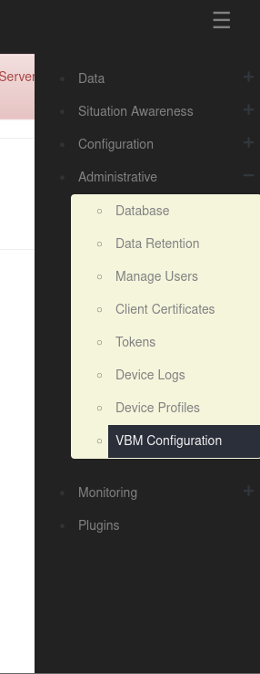

You will then see the following options.

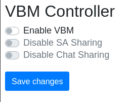

To modify the VBM configurations select the checkbox next to the desired option
and when you're finished click "Save changes".

NOTE::: "Disable SA Sharing" and "Disable Chat Sharing" will only be used if "Enable VBM" is selected.

The VBM options have the following impact:

If "Enable VBM" is selected, messages received on a data feed are only brokered to
clients which are subscribed to the mission if the message falls within the bounding box specified by the mission.
For example, the message represented by the blue dot would be passed on
while the message represented by the green dot would be filtered out for the mission
with the displayed bounding box only if "Enable VBM" is turned on.

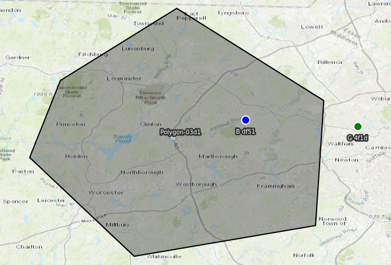

The second two options are only activated if "Enable VBM" is on,
and they refer to messages received from inputs (server ports).
These options filter messages based on whether they are chat messages.
Chat messages in this context are cot messages which have a type set to "b-t-f".

If "Disable SA Sharing" is selected,
messages received from inputs are passed on if the message is a chat message as defined above.

If "Disable Chat Sharing" is selected,
messages received from inputs are passed on if the messages is **NOT** a chat message as defined above.

These options are not mutually exclusive.
Therefore, having both selected will filter out all messages received on inputs.

[[webtak-1]]
== WebTAK

The WebTAK front-end application is bundled with TAK Server.
The WebTAK back-end WebSockets networking channel and APIs are provided by TAK Server.
WebTAK must be accessed using https.

WebTAK can be accessed either with X.509 client certificates (default https port 8443),
or by username-password access using OAuth (https port 8446).

In either case, TAK Server must be configured with a server certificate and truststore (see Appendix B).

In the Admin UI menu, use *Situation Awareness -> WebTAK* to access WebTAK.

[[device-profiles-1]]
== Device Profiles

TAK Server can now assist in provisioning ATAK devices through Device Profiles.
The Device Profile Manager (under Administrative Menu, Device Profiles)
allows administrators to build profiles that can be applied to clients when enrolling for certificates,
and when connecting to TAK server.
The Profile consists of a sets of files,
which can include settings and data in any file format that is supported by TAK Mission Packages.
Profiles can be made public or restricted to individual Groups.

When an ATAK device enrolls for client certificate,
or optionally after connecting to TAK server,
TAK server will return all profiles that need to be applied to the device.
The TAK server administrator can also push a profile to a connected user by clicking
the Send link within the Device Profile Manager.

[[federation-1]]
== Federation

Federation will allow subsets of ATAK users who are connected to different servers to work together,
even though each TAK server instance (hereafter refered to as 'federates')
may be run by independent organizations / administrative domains.
It brings some of the following benefits/restrictions:

1. Each administrative domain does not need to share anything about their internal structure
(e.g. LDAP/Active Directory information / users) with the other administrative domain.
2. Each administrative domain has control over what data they share with the other domain,
but has no control over what the other administrative domain does with data that is shared.
3. It requires no reconfiguration of ATAKs connected to either TAK Server,
and the mechanism for connecting the TAK Servers does not allow direct connections
of ATAK devices from the other administrative domain.

[[enable-federation-3]]
=== Enable Federation

The first step is to enable federation on your TAK server.
To do this, first go the Configuration > Manage Federates page.
If federation is not yet enabled, click on the Edit Configuration button.
This is also where you can pick the ports for each federation protocol.

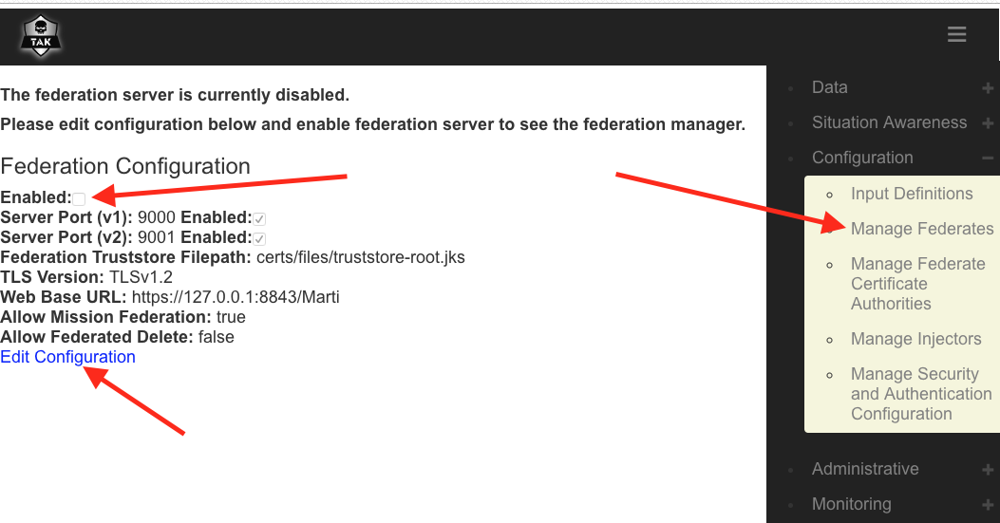

Do not forget to restart the server after changing the federation configuration
in order for the changes to take effect!

[[upload-federate-certificate-3]]
=== Upload Federate Certificate

In order for the federate servers to trust each other and their ATAK clients,
they must share each others certificate authorities (CAs) in order to create a separate federate trust-store.
One of the key components to how TAK Server satisfies all the restrictions
is that we use one trust-store for local users, and one for Federates.
The trust-store contains all the valid CAs that you will allow client certificates from.
By having separate trust-stores, we can have the Federation channels
allow connections with certificates from "outside" CAs,
while not allowing ATAKs with certs from those "outside" CAs to make direct connections to our server.

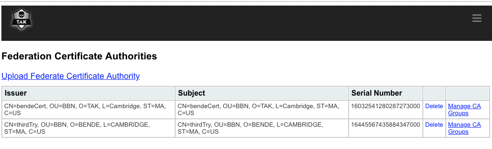

Generally, we share the public CA, which you can find at */opt/tak/cert/files/ca.pem*,
via some third channel such as email or a USB drive.
Once you have traded CAs, go the Manage Federate Certificate Authorities page
and upload the CA of the federate you want to connect to.

[[make-the-connection-3]]
=== Make the Connection

Now that we have enabled federation and shared our CA with the other TAK server authority,
we are ready to make the connection and start sharing.
For this step, only ONE of the servers creates an outgoing connection to the other.
If you are starting the connection, go back to the Manage Federates page where you enabled federation from step 1.
You will now see three sections, Active Connections, Outgoing Connection Configuration, and Federate Configuration.
To create an outgoing connection, click on the corresponding link,
and enter the address and port of the destination server.
You can also pick the protocol version (make sure it is the right protocol for the port you are connecting to!),
reconnection interval (how long between retries if the connection is lost),
and whether the connection will be enabled on creation.

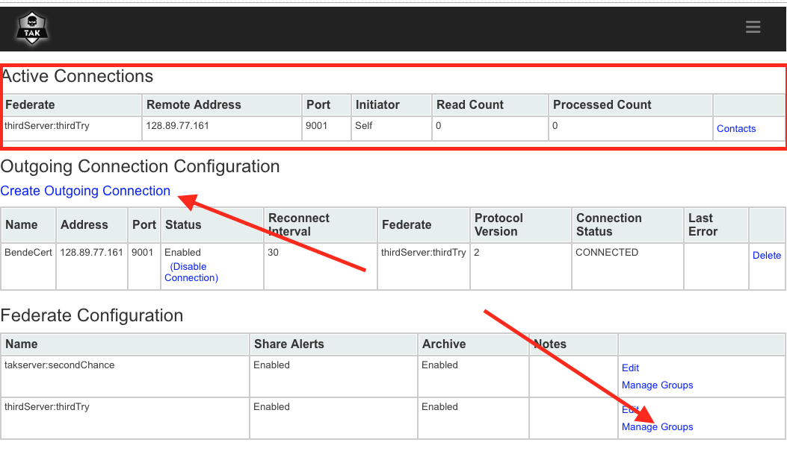

Now that you have created and started a connection,
you will notice that no information is yet flowing between federates.
This is because you and your fellow federate must specify which filtering groups
you will allow to flow out of and into your server.
To manage this, click on the Manage Groups link in the corresponding row of the Federate Configuration section.
Here you can specify the groups, including the special __ANON__ group if you want.
Once both servers have configured the groups, traffic will start to flow.
A server restart is not necessary for these changes to take effect.

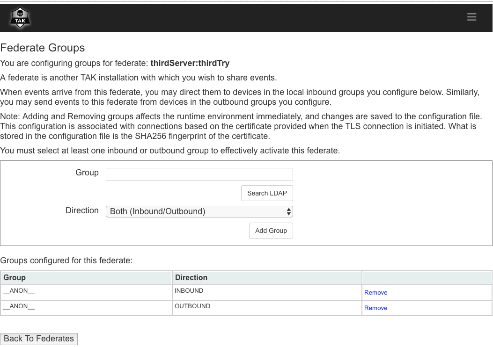

[[federated-group-mapping-3]]
=== Federated Group Mapping

The flow of traffic between Federates may be directed using end-to-end group mapping.
The** Federated Group Mapping **section is on the *Federate Groups* page.

Groups are exchanged during active connections between Federates.
The _remote_ groups will appear in the ‘Remote Group List’ drop down in the *Federated Group Mapping* section.
Connected Federates must have Federated Group Mapping enabled
in order for the Federates to exchange their respective _remote_ groups.
This parameter is in the **Federation Configuration **section in the Configuration > Manage Federates page.

To configure the end-to-end mapping, select a remote group and map it to a local Federate group.
Remote groups may also be entered directly in the ‘Remote Group’ field.
A single remote group can be mapped to many local groups.
Additionally, multiple end-to-end group mappings may be defined.
With a group mapping configured, traffic from the remote group will only flow to the mapped local group(s).

Note::: If no incoming traffic matches the remote groups configured,
the federation traffic will fall back to the *Federate Group* scheme described previously.

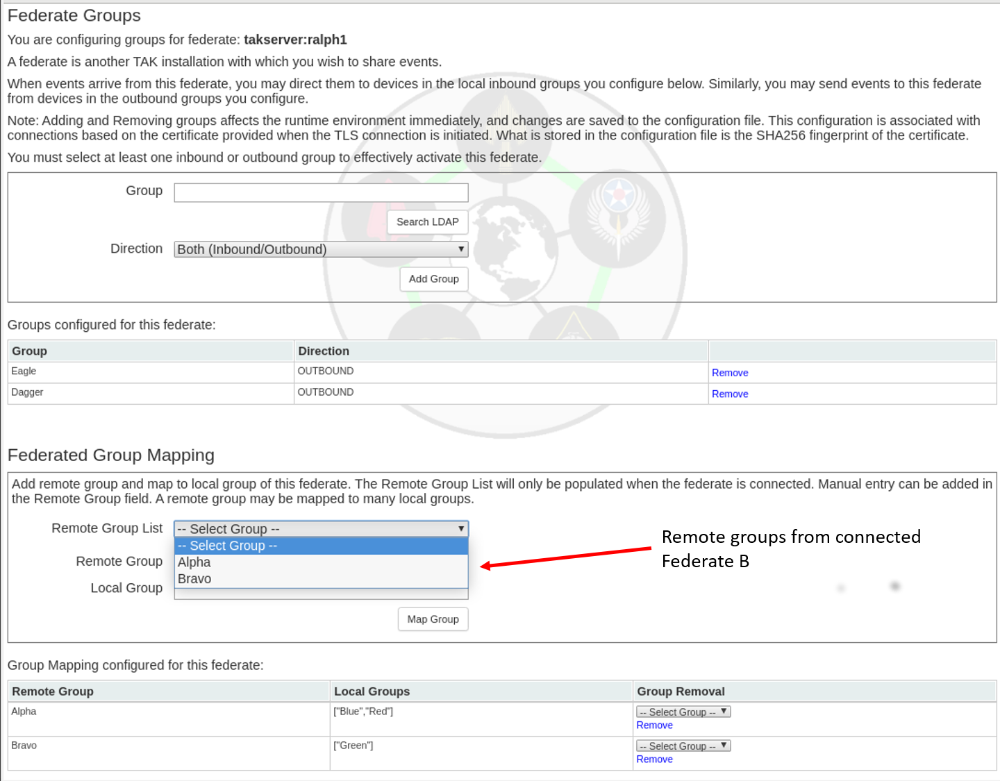

[[mission-federation-disruption-tolerance-3]]
=== Mission Federation Disruption Tolerance

Traffic between federated servers may be disrupted, and updates to missions could happen during that disruption.
Mission federation disruption tolerance will update each server
with changes to federated missions that occurred during the disruption.
To enable this feature, check the box in the Federation Configuration page:

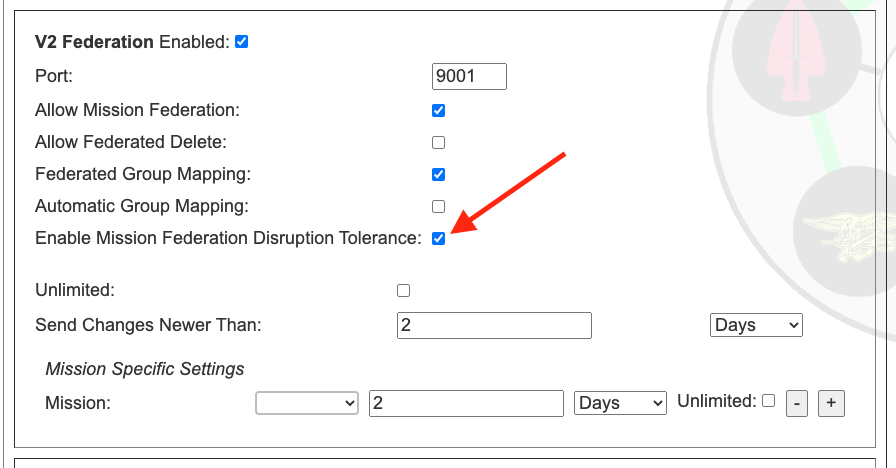

Sending all the changes that occurred between disruptions could potentially take a lot of bandwidth,
so by default, we limit the changes to those that occurred within the last 2 days.
For example, if a disruption lasted 3 weeks, we would only send the changes from the previous 2 days.
However, if the disruption only lasted a few hours, only the changes since the last disruption would be sent.
If the Unlimited checkbox is checked, then all changes since the last disruption would be sent.
The 2 day limit can be changed to any length with the Send Changes Newer Than setting,
and the period can be selected as days, hours, or seconds.

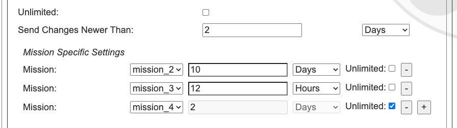

It is also possible to override the global setting for a particular mission, if so desired.

For example, in the above image, we see that mission_2 will send updates up to over the last 10 days,
mission_2 only over the last 12 hours, and mission_4 will send all updates since the last disruption.
Any mission that is not listed, and any subsequently added mission,
will follow the global setting of 2 days, as set above.

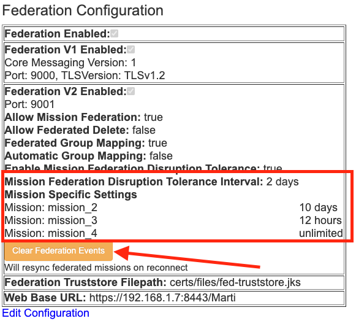

The Clear Federation Events button will reset the disruption history for federation.

This means that on the next reconnection,
the server will send the max allowed mission changes according
to the Mission Federation Disruption Tolerance settings.
In the above case, that would be 10 days for mission_2, 12 hours for mission_3,
and the entire change history for mission_4.
For all other missions this would be 2 days worth of mission changes.

[[data-package-and-mission-file-blocker-3]]
=== Data Package and Mission File Blocker

Data packages, mission packages, and missions can be federated between servers and their respective ATAK clients.
These packages may contain configuration files such as ATAK .pref files
that can result in the distribution of unwanted configuration changes to ATAK devices.
A filter can be enabled to block files by file-type.
To enable this feature, check the Data Package and Mission File Blocker box in the Federation Configuration page.
The default file extension value is 'pref'.
This can be changed by entering a new file type,
clicking on the 'Add' button to add the entry,
and clicking on the 'Save' button at the bottom of the Federation Configuration page.

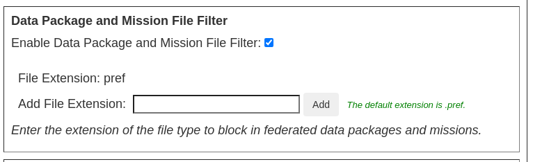

[[federation-example-3]]
=== Federation Example

The figure below shows a connectivity graph of two distinct administrative domains.
Each administrative domain has multiple sub-groups (e.g. "CN=Alpha") utilizing the group-filtering.
The color coding indicates the CA that is used to sign the certificate used for connections.
Enclave 1's CA signs ATAK client certs and a server certificate.
Enclave 2's CA also signs ATAK client certs and a server cert.
The trust-store listing the allowed CAs for the "User Port" only contains a single CA
(i.e. _Enclave 1 CA_ for Enclave 1).
To federate the servers, Enclave 1 and Enclave 2 send each other the "public" CA cert.
Those certificates are put in a separate trust store that is used only for federation connections.
The "Fed.
Port" is configured with this separate trust-store.

The server cert from each administrative domain can now be used to connect to the "Fed.
Port" of the other domain.

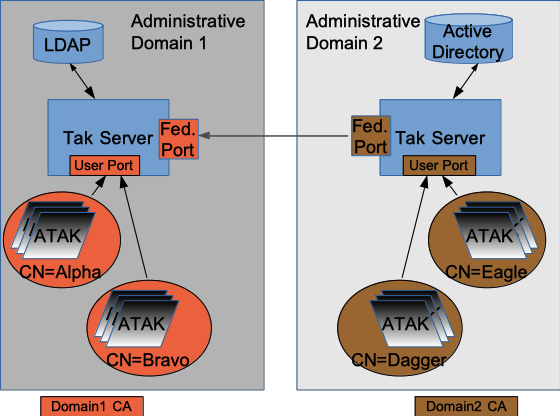

[[alternate-configuration-3]]
=== Alternate Configuration

The first example had each federate using the same CA and server certificate for local and federate connections.
If you are very paranoid, or don't want to share anything about the crypto being used for local clients,
you can have a wholly separate CA+server certificate chain that is used for federation.
Figure 5 shows how this would work.

This adds some complexity,
but can be used if you don't want to expose your 'internal' CA to the organizations that you are federating with.

[[figure-2-alternate-federation-examplemetrics-1]]
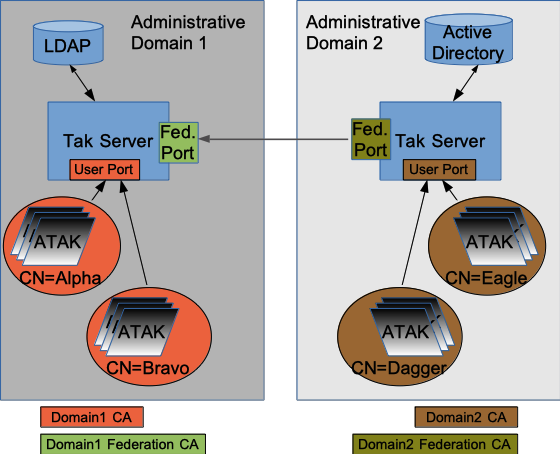

== Metrics

The TAK Server Metrics Dashboard is available in the Monitoring menu.
The dashboard continuously renders the following information:

_Server Start Time and Server Up Time_:
This tell you when the server was turned on and how long it has been operating.

_Clients Connected_: This tells you how many connections your client is currently servicing.
This corresponds to the number of clients that are displayed in the client dashboard.

_Heap Usage_: TAK server runs inside one or more Java Virtual Machines (JVM).
Heap Committed is how much heap memory in MB is allocated to the API process for TAK Server,
and Heap Used is how much of that is currently being used.

_Network I/O and Reads/Writes_: This tells you how much TCP and UDP traffic the server is currently handling,
as well as a brief history.

_CPU Usage_: How much of the CPU of the machine the server is running on is currently being used.

[[figure-3-metrics-dashboardlogging-1]]
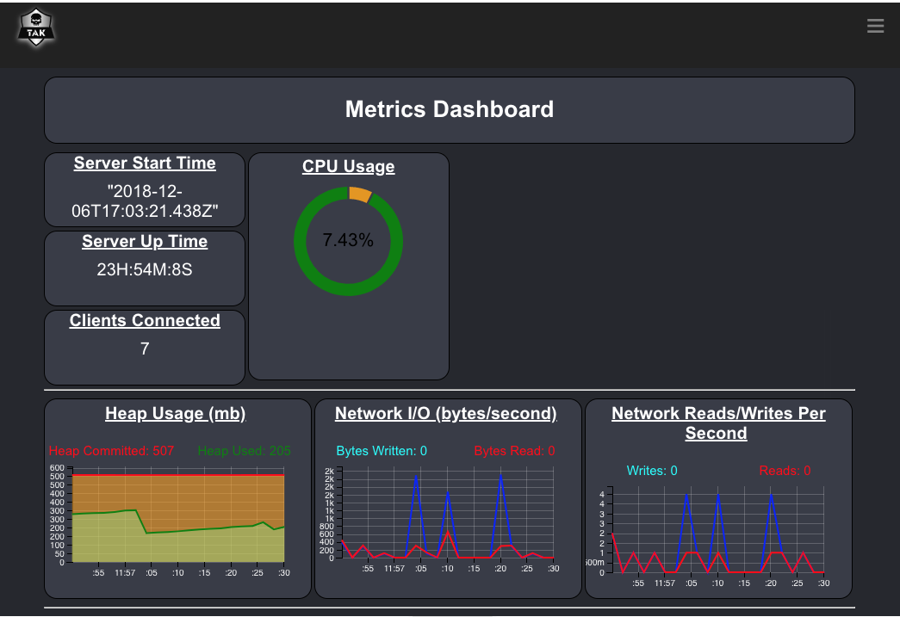

== Logging

TAK Server provides several log files to provide information about relevant events that happen during execution.
The log files are located in the _/opt/tak/logs_ directory.
This table shows the name of the log files, and their function.

[cols=",",]
|===
|Name of Log File | Purpose

|takserver-messaging.log 
| Execution-level information about the messaging process,
including client connection events, error messages and warnings.

|takserver-api.log  
|Execution-level information about the API process, including error messages and warnings.

|takserver-messaging-console.log 
| Java Virtual Machine (JVM) informational messages and errors, for the messaging process.

|takserver-api-console.log 
| Java Virtual Machine (JVM) informational messages and errors, for the API process.
|===

[[group-filtering-for-multicast-networks-1]]
== Group Filtering for Multicast Networks

The proxy attribute on the CoreConfig input element ( <input … proxy="true" … /> ) was removed in TAK Server 4.1.
The intent of the proxy attribute was to control bridging of multicast networks and federating multicast data.
As TAK Server’s group filtering capabilities have evolved, having a dedicated proxy attribute is no longer needed.
Using filtergroup on the mcast input you can achieve greater control over multicast traffic.

The default behavior in TAK Server 4.1 and higher is to put multicast traffic in the __ANON__ group.
You can use a filtergroup on the mcast input to put your mcast traffic into a dedicated multicast group,
for example:
[source,xml]
----
<input auth="anonymous" _name=" SAproxy " protocol="mcast" port="6969" group="239.2.3.1">
  <filtergroup>__MCAST__</filtergroup>
</input>
----

Then add the __MCAST__ group as a filtergroup on any other inputs you wanted to share multicast traffic with.
For example, to share multicast traffic with the tls/8089, configure your input filtergroups as follows:
[source,xml]
----
<input auth="anonymous" _name="stdssl1" protocol="tls" port="8089" archive="true">
  <filtergroup>__ANON__</filtergroup>
  <filtergroup>__MCAST__</filtergroup>
</input>
----

This same approach works for federations.
You can __MCAST__ as an outboundGroup on any federates that you wanted to share multicast traffic with.
Using the filtergroup approach allows for creation of input specific multicast groups,
allowing control of how messages from multicast networks are routed.

[[oauth2-authentication-1]]
== OAuth2 Authentication

TAK Server provides OAuth2 Authorization and Resource server capabilities
using the OAuth2 Password authentication flow.
OAuth2 integration works with existing authentication back ends,
allowing TAK Server to issue tokens backed by the File or LDAP authenticators.
TAK Server issues JSON Web Tokens (JWT) signed by the server certificate,
allowing external systems to validate tokens against the server’s trust chain.
The OAuth2 token endpoint is available at `https://<takserver>:8446/oauth/token`.

[[user-management-ui-1]]
== User Management UI

=== Overview

The User Management UI provides an intuitive drag-and-drop mechanisms for managing TAK user accounts.
The tool is integrated within TAK Server and can be accessed from the TAK main menu,
under #Administrative >> Manage Users#.
Users need to have an admin role to access the tool.
Currently, the User Management UI supports only file-based users and not LDAP/AD users.

The tool allows TAK administrators to create, manage, inspect and delete TAK user accounts.
More specifically, the tool allows TAK administrators to:

- View, filter and search for existing user accounts and groups.

- View a list of users in each group.

- Change password for each user account.

- View and update groups (IN group, OUT group and both) for each user account.

- Delete user accounts.

- Create a new user account with a specified password and groups.
Password complexity is checked to confirm compliance.

- Create new user accounts in bulk with username following a pattern.
System uses password generation mechanism to create passwords that meet TAK password complexity requirements.
System produces output file with user/password combos as a one-time downloadable item,
after which system forgets the un-hashed passwords.

- Create new groups.

=== Usage

The below figure shows the main page of the User Management UI.
The left panel lists all user accounts, which can be filtered using the Search box on the top.
The right panel lists all existing groups, which can be filtered using the Search box on the top.

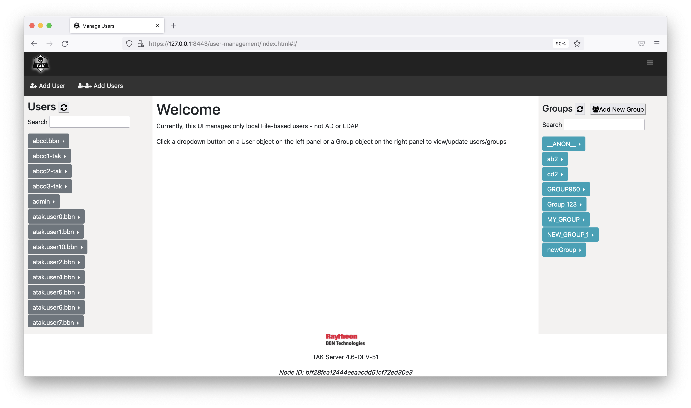

To change user’s password, click on the arrow right next to the username and select "Change password".

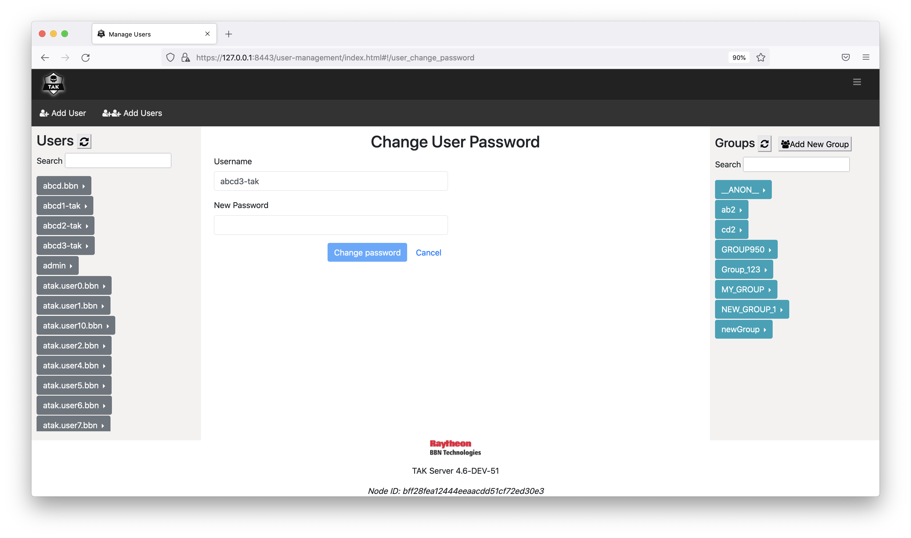

To view/edit groups for a user account, click on the arrow right next to the username and select "View/Edit groups".
You can drag the groups from the right panel and drop to one of the three boxes in the middle panel.
Click on "Reset" button to bring the UI back to showing the current groups of the user.
Click on "Update" button to update the groups of the user.

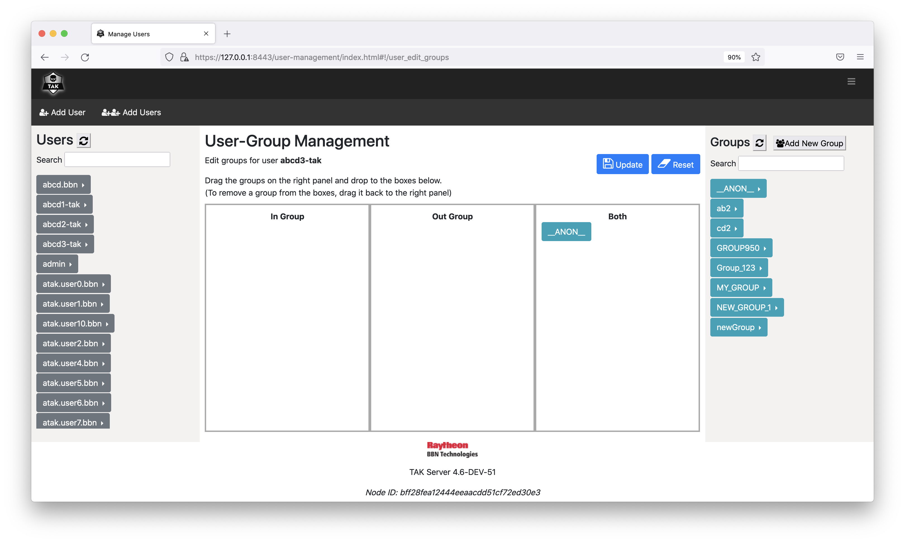

To delete an account, click on the arrow right next to the username and select "Delete User".
You will be prompted to either confirm or cancel the action.

To list all users in a group, click on the arrow right next to the group name and click on "List users".

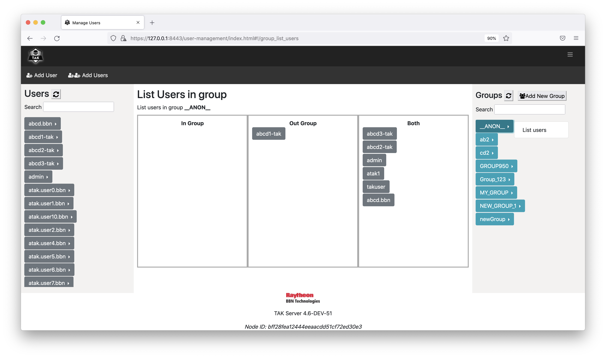

To create a new user, click on "Add User" on the menu bar.

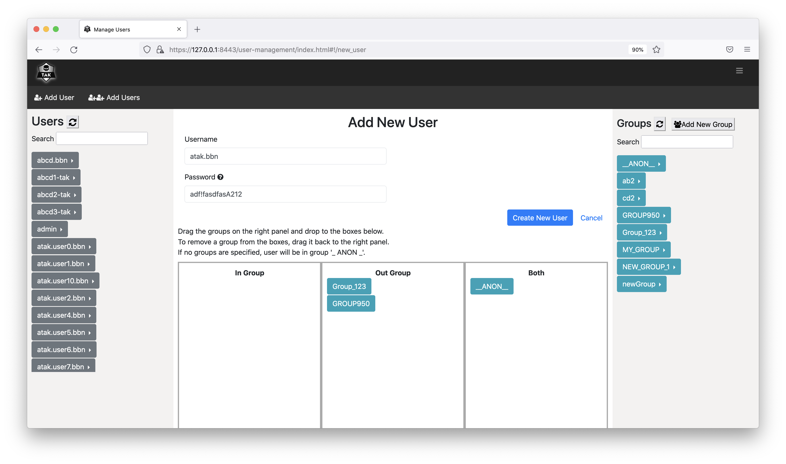

To create new users in bulk, click on "Add Users" on the menu bar.

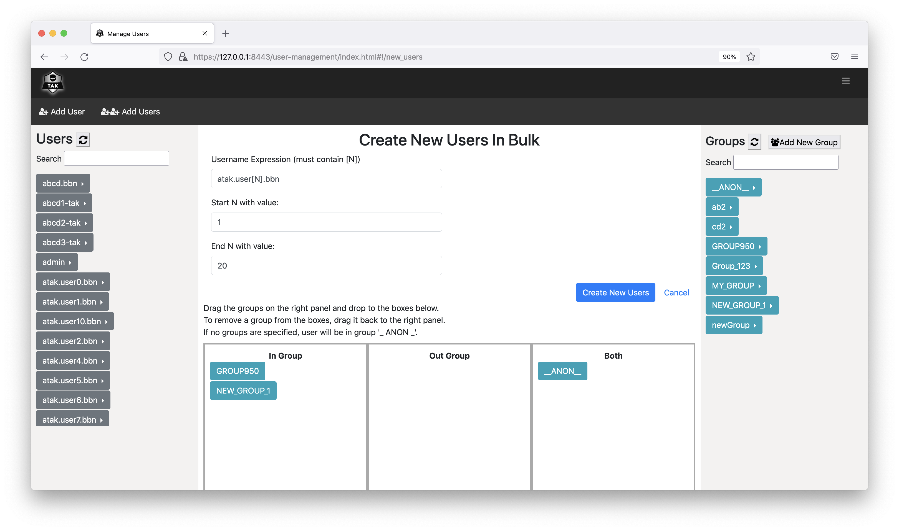

[[data-retention-tool-1]]
== Data Retention Tool

Information regarding the use of the Data Retention Tool is available on the tak.gov wiki:

https://wiki.tak.gov/display/TPC/Data+Retention+Tool

[appendix]
== Acronyms and Abbreviations

ATAK – Android Team Awareness Kit

CA – Certificate Authority (for digital certificates)

CN – Common Name (of a digital certificate)

CoT – Cursor-on-Target, an XML-based data interchange format

CRL – Certificate Revocation List

DoD – Department of Defense (United States)

DISA – Defense Information Systems Agency

ESAPI – Enterprise Security Application Programming Interface

EPL – Evaluated Products List

HTTP – Hypertext Transfer Protocol

IA – Information Assurance

IP – Internet Protocol

IPv4 – Internet Protocol, version 4.
The commonly-used version of IP, in which addresses consist of four integers from zero to 255 (inclusive),
separated by periods, such as 192.168.123.4

JCE – Java Cryptography Extensions

JDK – Java Development Kit, a JRE with additional tools and libraries.

JKS – Java Key Store

JRE – Java Runtime Environment

KML – Keyhole Markup Language, the XML-based data format used by Google Earth

OS – Operating System

OWASP – Open Web Application Security Project

NIAP – National Information Assurance Partnership

PKCS12 – Public-Key Cryptography Standard #12

TCP – Transmission Control Protocol

RHEL – Red Hat Enterprise Linux

UDP – User Datagram Protocol

SSL – Secure Sockets Layer

TAK – Team Awareness Kit, a mobile or desktop application that sends
and receives real-time information through TAK Server.

TLS – Transport Layer Security, a newer and more-secure protocol derived from SSL.
The terms SSL and TLS are often used interchangeably.
Technically, TLS provides a superset of SSL's capabilities and should always be preferred.

XML – Extensible Markup Language

[appendix]
== Certificate Generation

TAK Server includes scripts for generating a private security enclave,
which will create a Certificate Authority (CA) as well as server and client certificates.

First, figure out how many client certificates you are going to need.
Ideally you should have a different client cert for each ATAK device on your network.

*Become the _tak_ user: `sudo su tak`*

Edit the certificate-generation configuration file, at this location:

_/opt/tak/certs/cert-metadata.sh_

Set options for country, state, city, organization, and organizational_unit.

Change directory:
[source,shell]
----
cd /opt/tak/certs
----

Create a certificate authority (CA):
[source,shell]
----
./makeRootCa.sh
----

Follow the prompt to name the CA.

Create a server certificate:
[source,shell]
----
./makeCert.sh server takserver
----
this command will result in a server certificate named `/opt/tak/certs/files/takserver.jks`

Create one or more client certificates.
You should use a different client cert for each ATAK device on your network.
This username will be provisioned in the certificate as the CN (Common Name).
When using certs on devices that are connected to an input that is configured for group filtering
without authentication messages,
this username will be used by TAK Server to look up group membership information in an authentication repository,
such as Active Directory (AD).
This command will create a cert for the username *user*:
[source,shell]
----
./makeCert.sh client *user*
----

Generate another cert, named **admin** to access the admin UI:
[source,shell]
----
./makeCert.sh client *admin*
----

The generated CA truststores and certs will be located here:

*_/opt/tak/certs/files_*

Follow the instruction on "Configure TAK Server Certificate" to set up the server
to use the generated certs and to authenticate users on a TLS port.
If using the default configuration, TLS will be correctly set up on 8443.

*_Become a normal user:_*
[source,shell]
----
exit
----

Restart the TAK Server:
[source,shell]
----
sudo systemctl restart takserver
----

Authorize the **admin** cert to perform administrative functions using the UI:
[source,shell]
----
sudo java -jar /opt/tak/utils/UserManager.jar certmod -A /opt/tak/certs/files/*admin*.pem_
----

[[configure-tak-server-certificate-1]]
== Configure TAK Server Certificate

In _/opt/tak_, check the following settings in _CoreConfig.xml_:

1. In the _<tls>_ element, the _keystoreFile_ attribute should be set to the server
keystore that was generated with _makeCerts.sh_, above.
If you followed the instructions verbatim, the server keystore is _/opt/tak/certs/files/takserver.jks_.
2. Also in the _<tls>_ element, the _truststoreFile_ attribute should be set to
the trust store that was generated with _makeCerts.sh_, above.
If you used the default arguments, your trust store file is _/opt/tak/certs/files/truststore-root.jks_.
3. In the _<network>_ element, add a TLS input,
specifying group-based filtering without requiring an authentication message:
+
[source,xml]
----
<input _name="stdssl" protocol="tls" port="8089" auth="x509"/>
----
+
You can change the port number if you want.

Example:
[source,xml]
----
<network multicastTTL="5">
  <!-- <input _name="stdtcp" protocol="tcp" port="8087"/> -->
  <!-- <input _name="stdudp" protocol="udp" port="8087"/> -->
  <input _name="stdssl" protocol="tls" port="8089" auth="x509"/>
  <!-- <input _name="streamtcp" protocol="stcp" port="8088"/> -->
  <!-- <input _name="SAproxy" protocol="mcast" group="239.2.3.1" port="6969" proxy="true"/> -->
  <!-- <input _name="GeoChatproxy" protocol="mcast" group="224.10.10.1" port="17012" proxy="true"/> -->
  <!--<announce enable="true" uid="Marti1" group="239.2.3.1" port="6969" interval="1" ip="192.168.1.137" />-->
</network>
----
[source,xml]
----
<security>
  <tls context="TLSv1"
       keymanager="SunX509"
       keystore="JKS"
       keystoreFile="certs/files/takserver.jks" keystorePass="atakatak"
       truststore="JKS"
       truststoreFile="certs/files/truststore-root.jks" truststorePass="atakatak">
    <!-- <crl _name="Marti CA" crlFile="certs/ca.crl"/> -->
  </tls>
</security>
----
Uncomment the 'crl' element, if you are using a CRL.

Then (re)start the TAK Server as normal.

[[installing-client-certificates-1]]
== Installing Client Certificates

Take the _truststore-root.p12_ and _user.p12_ files and copy them to your Android device.
In ATAK, open #Settings->General Settings->Network Settings#.

and set the SSL/TLS Truststore and Client Certificate preferences to point to those .p12 files.

Repeat the procedure described above for creating a new server connection,
but be sure to select *SSL* as the protocol.

These same .p12 files can be installed in a browser,
and used to access the Web UI (for admin use) and WebTAK (for normal users or admins).
The process to install these files varies by browser and operating system,
but can generally be configured by going to the browser preferences, and the security or certificates section.

[appendix]
== Certificate Signing

TAK Clients can enroll for new client certificates by submitting a Certificate Signing Request (CSR) to TAK Server.
The Certificate Signing endpoint resides on port 8446
and requires HTTP Basic Authentication backed by either File or LDAP authentication.
Ensure that the tomcat connector for port 8446 is active within tomcat-home/conf/server.xml.

The CertificateSigning section in CoreConfig.xml specifies how CSRs are processed.
TAK Server can be configured to sign certificates directly,
or proxy CSRs to a Microsoft CA instance running Certificate Enrollment Services.
To configure TAK Server to sign certificates, set the CA attribute to "TAKServer".
To configure TAK Server to proxy the CSR to MS CA, set the CA attribute to "MicrosoftCA".

[source,xml]
----
include::{config_dir}/certificate-signing.xml[]
----

Prior to submitting a CSR, Clients query TAK Server for Relative Distinguished Names (RDNs)
that need to go into the CSR.
The nameEntries element in CoreConfig.xml specifies the required RDNs,
giving the administrator control over generated certificates.
The CN value in the CSR will be equal to the HTTP username.
TAK Server validates all required fields in the CSR prior to signing.

The extra step of having client query TAK Server for RDNs wouldn't be required
if TAK Server were signing certificates exclusively, since TAK Server could just add these names to the certificate.
However, when proxying the CSR to an external CA,
this allows additional flexibility in controlling the subject name within the certificate.

The TAKServerCAConfig element specifies the keystore that TAK Server will use for signing certificates.
The keystore must hold the CA's private key along with its full trust chain.
The makeCert.sh script will produce a signing keystore when generating an intermediate CA certificate.
Certificates signed by TAK Server will be valid for the specified validityDays,
and will be signed using the algorithm specified by signatureAlg.

The MicrosoftCAConfig element defines how TAK Server will connect
to the Certificate Enrollment Services (CES) endpoint.
The CES endpoint is defined by the svcUrl attribute.
The CES endpoint must be configured to use Username/Password authentication,
and by default will include 'UsernamePassword' in the URL.
The username and password attributes refer to an account configured on the MS CA Server to access the CES endpoint.
The truststore and truststorePass attributes point to a Java keystore (.jks) file
that contains the trust chain for the svcUrl endpoint.
Lastly, the templateName defines the certificate template that will be used to sign CSRs sent from TAK Server.

[appendix]
== PostgreSQL TLS Configuration

[[configure-postgresql-server-to-use-tls-1]]
== Configure PostgreSQL server to use TLS

- Follow the steps in Appendix B (Certificate Generation) to generate CA keys and certificates if not already done so.

- Generate PostgreSQL server keys and certificates:
+
[source,shell]
----
cd /opt/tak/certs
sudo su tak
./makeCert.sh server takdb
----

Become a normal user
[source,shell]
----
exit
sudo chown postgres /opt/tak/certs/files/takdb.key
----

- Update postgresql.conf.
The file location can be different depending on your PostgreSQL installation:

RHEL/Rocky/CentOS:: /var/lib/pgsql/15/data/postgresql.conf
Ubuntu/RaspPi:: /etc/postgresql/15/main/postgresql.conf

[source,shell]
----
sudo vim /var/lib/pgsql/15/data/postgresql.conf
----
[source,ini]
----
include::{config_dir}/postgresql.conf[]
----

- Update pg_hba.conf.
The file location can be different depending on your PostgreSQL installation:

RHEL/Rocky/CentOS:: /var/lib/pgsql/15/data/pg_hba.conf
Ubuntu/RaspPi:: /etc/postgresql/15/main/pg_hba.conf

[source,shell]
----
sudo vim /var/lib/pgsql/15/data/pg_hba.conf
----

Add this new line:
[source,text]
----
hostssl all all all cert
----

Comment out the following lines if you also require SSL authentication for IPv4/IPv6 local connections
[source,text]
----
# host all all 127.0.0.1/32 trust
# host all all ::1/128 trust
----

- Restart PostgreSQL server.
Make sure it starts successfully.

RHEL, Rocky Linux, and CentOS installations:
[source,bash]
----
sudo systemctl restart postgresql-15
sudo systemctl status postgresql-15
----

Ubuntu and Raspberry Pi installations:
[source,bash]
----
sudo systemctl restart postgresql
sudo systemctl status postgresql
----

[[generate-client-keys-and-certificates-1]]
== Generate Client keys and certificates

- Generate client keys and certificates:
[source,bash]
----
cd /opt/tak/certs
sudo su tak
./makeCert.sh dbclient
----

Client keys and certificates named "martiuser" (by default) will be created in the "files" directory.

- Test SSL connection using the generated client certificate:
[source,bash]
----
psql "host=127.0.0.1 port=5432 user=martiuser dbname=cot \
   sslmode=verify-ca sslcert=files/martiuser.pem sslkey=files/martiuser.key sslrootcert=files/ca.pem"
----

If you don’t want to verify the server’s credential:
[source,bash]
----
psql "host=127.0.0.1 port=5432 user=martiuser dbname=cot \
   sslmode=require sslcert=files/martiuser.pem sslkey=files/martiuser.key"
----

The sslmode "verify-ca" means "I want to be sure that I connect to a server that I trust."
The sslmode "require" means "I trust that the network will make sure I always connect to the server I want."

More information on the sslmode can be found here: https://www.postgresql.org/docs/current/libpq-ssl.html

- Test database permission from the psql prompt:
[source,sql]
----
select count(*) from cot_router;
----

NOTE:: If you want to use a different name for certificates,
you would also need to add a new user to the PostgreSQL database and grant permissions for the user.
For example, following these steps to create a certificate named "takdbuser".
[source,shell]
----
./makeCert.sh dbclient takdbuser
sudo su - postgres
----

Connect to Postgres:
[source,bash]
----
psql -d cot
----

[source,text]
----
# List all users/roles:
\du
SELECT * FROM pg_roles;

# Create a new user ("takdbuser") and grant the user necessary roles ("martiuser").
The name of the user must match the CN in the client certificate.
CREATE USER takdbuser;

grant martiuser to takdbuser;

# Optional: Double check using \du and "SELECT * FROM pg_roles;"
----

[[configure-tak-server-to-use-ssl-1]]
== Configure TAK Server to use SSL 

- Note that when you created a database client certificate (./makeCert.sh dbclient),
an additional private key file in PKCS#8 format was created.
Use this file for the param sslkey in CoreConfig.xml instead of using the files with .key extension.

- Update CoreConfig.xml:

Update the <connection> tag in <repository> (Remember to use a correct hostname/IP)
[source,xml]
----
<connection url="jdbc:postgresql://127.0.0.1:5432/cot" username="martiuser"
            sslEnabled="true" sslMode="verify-ca" sslCert="certs/files/martiuser.pem"
            sslKey="certs/files/martiuser.key.pk8" sslRootCert="certs/files/ca.pem"/>
----

If you don’t want to verify the server’s credential (not recommended in production):
[source,xml]
----
<connection url="jdbc:postgresql://127.0.0.1:5432/cot" username="martiuser"
            sslEnabled="true" sslMode="require" sslCert="certs/files/martiuser.pem"
            sslKey="certs/files/martiuser.key.pk8" />
----

- Start/Restart TAK server.
[source, bash]
----
sudo systemctl restart takserver
----

